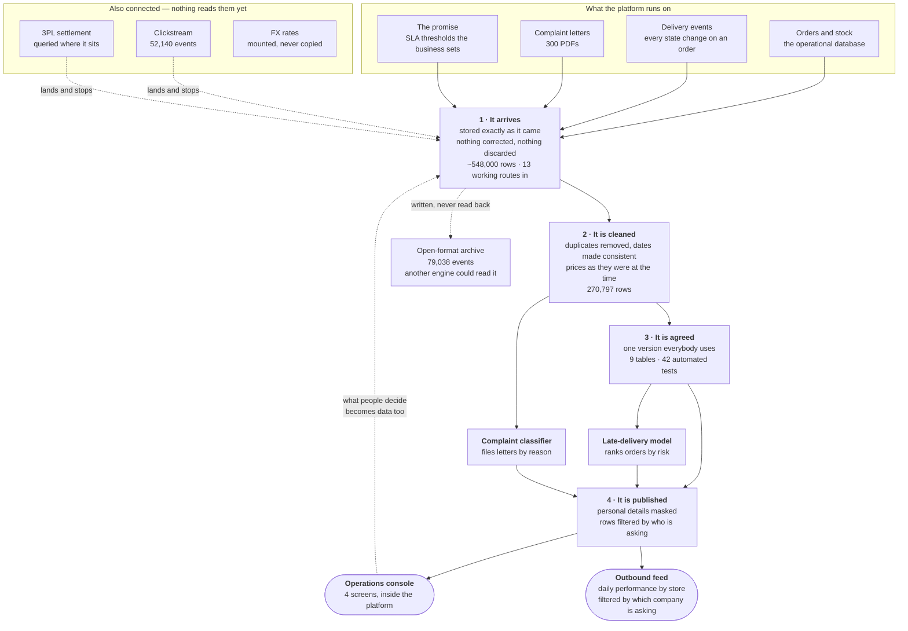

# Quick-Commerce Analytics Platform

A complete analytics platform for a grocery delivery operator, built on Snowflake.
This is the only document. It covers what the platform is, what it does, how it is
built, what it cost, and what building it uncovered.

**Status: complete.** Fifteen stages, eight days, **5.87 credits** — 7.3% of its
budget.

---

## 1. What this is, in plain terms

A company runs **eight small local warehouses** — "dark stores" — that hold grocery
stock. You order on an app, and the company promises delivery in 10 to 25 minutes.
Sometimes it does not make it. **About one order in six arrives late.**

This platform is where all of that ends up so somebody can do something about it.



Three things happen to the data, in order:

1. **It arrives.** Orders, deliveries, stock levels and written complaints stream in
   from the systems that produce them, and are stored exactly as they came.
2. **It is cleaned and agreed.** Duplicates removed, dates made consistent, prices as
   they were *at the time* rather than as they are now. One version everybody uses.
3. **It is put to work.** Two models read it, at different depths — the late-delivery
   model reads the agreed version, the complaint classifier reads the cleaned one,
   because a letter never needed a dimensional model to be filed by reason. A small
   application puts both in front of the people who act on them.

The fourth step is easy to miss and matters most: **what those people decide is
written back down.** A dispatcher who reassigns a rider is creating the training data
for the next version of the model. **The platform is a loop, not a pipeline.**

Almost nothing leaves. The models are trained inside the platform, the application
runs inside it, and no data is copied out to be processed elsewhere. One feed is
published on purpose: daily delivery performance by store, where **which rows each
recipient sees is decided by who is asking**.

---

## 2. What it answers

| Question | Who asks it | Where the answer comes from |
|---|---|---|
| Which orders in flight will breach their promise? | Dispatcher | Risk queue, §6 |
| Which stores miss their promise, at which hours? | Operations | Store heatmap, §7 |
| Why did the on-time rate move? | Regional management | The dimensional model, §4 |
| How much stock will each store need? | Supply planning | Daily stock snapshots |
| What are customers complaining about? | Customer experience | Triage queue, §6 |
| Who may see customer contact details? | Compliance | The protection layer, §8 |

---

## 3. Scale

| | |
|---|---|
| Dark stores | 8 (Delhi NCR) |
| Riders / customers / products | 60 / 500 / 200 |
| Orders | 20,000 over 60 days |
| Order lines | 54,635 |
| Stock snapshots | 96,000 |
| Delivery events | 79,663 |
| Complaint letters | 300 |
| **Late-delivery rate** | **16.4% by design, 16.45% recomputed independently** |

Money is stored as **integer paise** everywhere. No decimal currency appears in the
pipeline — it survives JSON, streaming, and Python without a rounding argument.

**Data defects are injected on purpose** so downstream handling is exercised rather
than assumed: 1% duplicate events (reflecting at-least-once delivery), and 2% skipped
or out-of-order status transitions.

---

## 4. How the platform is organised

One database, `QCOMMERCE`. Nine schemas, and **the schema an object lives in is the
statement of who may read it** — that is the access design, not a naming convention.

| Schema | Holds | Rule |
|---|---|---|
| `LAND` | Stages, pipes, file formats, integrations | **No tables.** No data at rest |
| `RAW` | Data exactly as it arrived, 21 tables | Append-only. No dedupe, no casting |
| `CORE` | Deduplicated, typed, history-tracked, 13 tables | The one place duplicates are resolved |
| `MART` | The dimensional model, 9 tables | Star schema. Protection attaches here |
| `LAB` | Features, training sets, model output | Transient sandbox |
| `SERVE` | The published contract | Nothing arrives without passing tests |
| `SEMANTIC` | Metric definitions | One definition per metric |
| `APP` | The Streamlit console | Reads `SERVE` |
| `OPS` | Quality results, model metrics, alerts, credits | Written by every layer |

### Who owns what

| Technology | Owns | Does not own |
|---|---|---|
| Snowflake native (pipes, streams, dynamic tables) | `LAND` → `RAW` | Any business logic |
| **dbt** | `RAW` → `CORE` → `MART` | Ingestion, training |
| **Snowpark** | `LAB` — features, training, scoring, UDFs | Anything expressible in SQL |
| **Streamlit in Snowflake** | The console | `RAW`, `CORE`, `LAB` |

Boundary test: expressible in SQL → dbt owns it. Needs scikit-learn or row-wise Python
→ Snowpark owns it.

---

## 5. The sources, and how data gets in

### Seven sources. Fourteen routes. Those are different numbers.

A *source* is something the business has. A *route* is a way of moving it. Three of the
routes below carry the **same** delivery events on purpose so they can be compared, and
one route is refused by this account entirely.

| # | Business source | Who owns it | Lands as | Reaches `MART`? |
|---|---|---|---|---|
| 1 | **Orders and stock** — the app's own live database | You | `RAW.CDC_ORDERS`, `CDC_ORDER_ITEMS`, `CDC_CUSTOMERS`, `CDC_PRODUCTS`, `CDC_RIDERS`, `CDC_DARK_STORES`, `CDC_INVENTORY` | **yes** |
| 2 | **Delivery status events** — every state change on an order | You | `RAW.ORDER_STATUS_KAFKA_V4`, `ORDER_STATUS_SDK`, `ORDER_STATUS_KAFKA_V3FILE` | **yes** (one of the three) |
| 3 | **The promise** — SLA thresholds, category tree, reason codes | The business *decides* these | `RAW.SLA_THRESHOLD`, `CATEGORY_HIERARCHY`, `COMPLAINT_REASON_CODE`, `COMPLAINT_LABEL` | **yes**, joined |
| 4 | **Complaint letters** — free prose from customers | Customers | `RAW.COMPLAINT_DOC` | to `LAB`, not `MART` |
| 5 | **Clickstream** — app and web behaviour | You | `RAW.CLICKSTREAM_AUTO`, `CLICKSTREAM_REST` | **no — stops at `RAW`** |
| 6 | **3PL settlement** — the logistics partner's own account | The partner | `RAW.EXT_SETTLEMENT` — queried where it sits, never loaded | **no — stops at `RAW`** |
| 7 | **FX rates** — bought reference data | A data vendor | `FINANCE__ECONOMICS` — mounted, nothing copied | **no — read live** |

**Sources 5, 6 and 7 terminate at landing, and that is deliberate.** They exist to prove
the mechanism — an event queue that wakes the warehouse, a partner file reconciled
rather than trusted, a dataset read without copying it. None of them has a consumer
today. Saying so is the difference between a platform and a demonstration, and this is
both: **sources 1 to 4 are the platform; 5 to 7 are the demonstration.**

The Iceberg archive (`RAW.ORDER_EVENTS_ICEBERG`) is the same — 79,038 events written in
an open format that another engine could read. Nothing in this project reads it back.

### The same thing, at each layer

Read left to right to follow any business object through the platform.

| The business thing | Arrives as | Cleaned into | Published as |
|---|---|---|---|
| An order | `RAW.CDC_ORDERS` | `CORE.ORDER_HEADER` | `MART.FCT_ORDER` |
| A line on that order | `RAW.CDC_ORDER_ITEMS` | `CORE.ORDER_ITEM` | `MART.FCT_ORDER_ITEM` |
| What happened to it | `RAW.ORDER_STATUS_KAFKA_V4` | `CORE.ORDER_STATUS_EVENT` | `MART.FCT_ORDER_STATUS_EVENT` |
| The customer | `RAW.CDC_CUSTOMERS` | `CORE.CUSTOMER` | `MART.DIM_CUSTOMER` |
| The store | `RAW.CDC_DARK_STORES` | `CORE.STORE` | `MART.DIM_STORE` |
| The rider | `RAW.CDC_RIDERS` | `CORE.RIDER` | `MART.DIM_RIDER` |
| The product, **and its price history** | `RAW.CDC_PRODUCTS` | `CORE.PRODUCT` (now) + `CORE.DIM_PRODUCT` (every version) | `MART.DIM_PRODUCT` |
| Stock on hand | `RAW.CDC_INVENTORY` | `CORE.INVENTORY_DAILY` | `MART.FCT_INVENTORY_DAILY` |
| A complaint | `RAW.COMPLAINT_DOC` | `CORE.COMPLAINT` | `LAB.COMPLAINT_PREDICTION` → `SERVE.COMPLAINT_TRIAGE` |

`CORE` also produces three tables with no `RAW` source of their own, because they are
**conclusions** rather than records — what the event stream means once read in order:

| | Holds | Rows |
|---|---|---|
| `CORE.ORDER_FUNNEL` | orders that went placed → packed → picked up → delivered, cleanly | 19,029 |
| `CORE.ORDER_CANCELLED` | orders that stopped, and how far they got first | 623 |
| `CORE.ORDER_LIFECYCLE_ANOMALY` | orders whose events arrived out of order or skipped a step | 348 |

Those three sum to 20,000 — every order, in exactly one of them.

### Following one late order, end to end

**A worked example.** The object names, the thresholds and the table counts are real.
The one order's own figures — 19:04, 18 minutes promised, 26 delivered, 0.23 and 0.31 —
are illustrative, chosen to show the path rather than measured from a specific row.

1. A customer orders at 19:04. The row appears in the operational database and change
   capture carries it to `RAW.CDC_ORDERS` within seconds, **exactly as written** —
   no cleaning, nothing discarded.
2. `RAW.SLA_THRESHOLD` says that store, at that hour, promises 18 minutes. **The promise
   is data, not code.**
3. The order is packed, picked up, delivered. Four events land in
   `RAW.ORDER_STATUS_KAFKA_V4`. One is a duplicate — the broker delivers at least once —
   and it stays, because `RAW` never dedupes.
4. `CORE.ORDER_STATUS_EVENT` resolves the duplicate. `CORE.ORDER_FUNNEL` reads the four
   events in order and finds delivery took 26 minutes against 18 promised.
5. `MART.FCT_ORDER` records the order as breached, priced at the product's price **at
   19:04** — from `CORE.DIM_PRODUCT`, not today's price.
6. The risk model had already scored it at 19:04, from what was knowable then: distance,
   store load, hour of day. It said 0.23. `SERVE.ORDER_RISK` carries the score and the
   outcome side by side, which is the only way to find out whether the model was right.
7. The customer writes in. The letter becomes `RAW.COMPLAINT_DOC`, then
   `CORE.COMPLAINT`, and the classifier files it as `LATE_DELIVERY` with confidence
   0.31 — below the 0.235 auto threshold, so `SERVE.COMPLAINT_TRIAGE` routes it to a
   person rather than an automatic reply.
8. That person acts. What they decide is written to `SERVE.ACTION_LOG` — **and becomes
   training data for the next model.** This is the loop closing.

### The fourteen routes

Each exists where the others are wrong. A partner will not change their file schedule; a
dataset someone is willing to share should not be copied.

| # | Route | Mechanism | Rows |
|---|---|---|---|
| 1 | Kafka → warehouse, row by row | Kafka connector v4, streaming | 79,663 |
| 2 | Direct streaming, no broker | Streaming SDK with offset tokens | 79,663 |
| 3 | Kafka → warehouse, micro-batch | Kafka connector v3, file mode | 79,663 |
| 4 | Storage notifies the warehouse | Auto-ingest via event queue | 52,140 |
| 5 | Client notifies the warehouse | REST `insertFiles`, internal stage | 8,097 |
| 6 | Bulk historical load | `COPY` with schema inference | 40,000 |
| 7 | Source schema change absorbed | Schema evolution on `COPY` | +1 column |
| 8 | Query files without loading | External table + insert-only stream | 2,800 |
| 9 | Open-format archive | Apache Iceberg v3 on an external volume | 79,038 |
| 10 | Unstructured documents | Directory table + `pypdf` UDF | 300 |
| 11 | Outbound call from the warehouse | *Blocked — see §11* | — |
| 12 | Shared dataset, zero copy | Marketplace share, queried live | 15,683 |
| 13 | DataFrame to table | `write_pandas` | 8 |
| 14 | Version-controlled constants | dbt seeds with tests | 125 |

**Routes 1, 2 and 3 carry identical input.** The same 79,663 events arrive three ways
so their latency and cost can be compared with the data held constant. Set difference
in both directions returns zero for all three pairs. **The comparison is the
deliverable, not the ingestion.**

Every `RAW` table carries the source filename, row number and load timestamp where the
mechanism allows — this is what makes a bad load reversible without a full reload.
**Dedupe in `CORE`, never `RAW`.**

### Source systems

PostgreSQL 16 in Docker is the operational source, with change data capture via
Debezium into Redpanda (Kafka API). `REPLICA IDENTITY FULL` on every replicated table,
so the log carries full before-images and history tracking can tell which attribute
changed.

Azure Blob Storage, plain GPv2 with **hierarchical namespace off** — with it on, the
Iceberg endpoint was Preview and `COPY … PURGE` fails because Azure only deletes empty
directories.

---

## 6. The two models

### Late-delivery risk

The question is asked **at the moment the order is placed**, when nothing about the
delivery has happened yet. That constraint decides the whole design.

| | |
|---|---|
| Population | 19,377 delivered orders |
| Split | 45 days train / 15 days test, strictly by time |
| Features | distance, peak hour, store load, basket size — **plus two placebos** |
| Held-out ROC AUC | **0.6479** |
| Calibration | within 0.70 points overall |
| Top decile | 34.73% breach against 7.34% bottom — 4.73×, 2.15× over base |

**Leakage-free by construction.** Everything recorded after placement is excluded —
the four milestone timestamps, three leg durations, the outcome, and the rider (rider
availability is a consequence of the same congestion being predicted). Cancelled
orders are dropped rather than labelled on-time: they have no delivery outcome, and
labelling them clean teaches the model about the label definition instead of the world.

**0.6479 is near this problem's ceiling, not a weak fit.** The source data adds an
unobserved random term before drawing each outcome, so a model holding the exact true
coefficients would score similarly. The two placebo features, whose true weight is
zero, came out at −0.015 and −0.051.

**A confound worth recording.** Store congestion truly increases risk, yet its raw
breach rate *falls* across its own quartiles — 17.09% down to 15.73%. Customers route
to their nearest store, so a busy store is one whose customers are close, and distance
buries it. The multivariate fit recovers the correct positive effect. **A quartile
table is description, not evidence.**

### Complaint classification

300 letters as PDFs, ten reason codes, 60 hand labels, 240 to classify. Built as
trained models running inside the warehouse, because the managed AI service is mostly
gated on this account (§11).

| | Term-weighting + logistic regression | Hashed vector + nearest neighbour |
|---|---:|---:|
| Accuracy on 240 held out | 85.42% | 84.58% |
| Macro-F1 | 0.7489 | 0.7446 |
| Phrasing seen in training | 203 / 203 | 202 / 203 |
| **Phrasing never seen** | **2 / 37** | **1 / 37** |

**The headline number is not the finding.** Each reason code comes from three sentence
templates and the 60 labels cover them unevenly, so 203 of the 240 held-out letters are
phrased the way something in training was phrased. On the 37 genuinely novel phrasings
the model scores **5.41% — below the 10% a uniform guess over ten classes would
achieve**, because its errors are systematic: unseen phrasings route to whatever shares
surface vocabulary. Two methods sharing nothing but the input text land 0.84 points
apart. **The ceiling belongs to the corpus, not either method.**

**What is operationally usable is the confidence score, not the classifier.** All 35
errors fall in the lowest confidence fifth. A threshold at 0.235 auto-files 80% of
complaints with zero errors and sends the rest to a person — and that threshold, not
the accuracy figure, is what the application is built on.

**Cross-validation overestimated the macro average** (0.7777 against 0.7489) because
its test rows come from the same 60 documents, so the real failure mode is invisible to
it. Plain accuracy matched to half a point; only the macro average exposed the gap.

**The answer key is separated by construction, not convention.** It lives in a
different schema, reached through a different storage path, and no statement in either
classifier references it — verified mechanically, not by review.

---

## 7. The application

Four screens running inside the platform, so no data leaves it to be displayed. Each
reads a published, governed view rather than the tables beneath, which means the
storage under any of them can be rebuilt without the application changing.

| Screen | Shows | Records |
|---|---|---|
| Operations | On-time rate by store and local hour | — |
| Risk queue | Orders ranked by predicted lateness | The dispatcher's decision |
| Complaints | Auto-filed against needs-a-person | A confirmed or corrected category |
| Health | Every quality check, model scores, decisions taken | — |

**The risk queue is a replay of past days, and the screen says so.** Every order was
delivered weeks ago, so a queue of orders in flight would be a mock-up. Replaying real
days is more useful for one reason: the outcome is already known, so a decision taken
on a prediction can be scored against what actually happened. **Acting on the 100
riskiest of 4,777 reaches about 35 of the 770 that were late — roughly 4.5× picking 100
at random.** That number, not the prediction, answers whether the score is worth a
dispatcher's time.

**Decisions are recorded, and that is the point of the screen rather than a feature of
it.** A dashboard shows numbers; this writes down what somebody did about them.

---

## 8. Protection

Every control is built **twice** and compared: once attached to the data itself, once
approximated with a restricted view.

| Concern | Built | Result |
|---|---|---|
| Column protection | Policy on the customer dimension, plus a secure view | The policy travels every path; the view protects one |
| Row protection | Store filter on the order fact | Inherited by the published views and the app, untold |
| Tag-driven | A PII tag with a policy bound to the tag | A column is masked with no policy of its own |
| PII discovery | Automated classification | **Changed the design** — see below |
| Data quality | One rule expressed three ways | Only the platform-native metric runs when nobody runs anything |
| Lineage | Three metadata sources compared | Only access history knows which *columns* were read |
| Cost attribution | Query tags, per stage | See §10 |

**Verified by role, not by grant.** Signed in as the analyst role, an email reads
`A***********`, a phone `XXXXXXXXX0819`, a coordinate stored at six decimal places
reads `28.55`, and the order fact returns 8,444 of 20,000 rows across 3 of 8 stores.
**Reading a grant proves nothing; neither does reading what the catalogue says is
attached.**

**The classifier disagreed with the hand tagging in both directions and was right both
times.** It found the customer's home coordinates as a high-confidence quasi-identifier
sitting unprotected — there is one household at six decimal places, so coordinates
re-identify more sharply than a phone number. It missed the phone column entirely,
because the values are in international format and its pattern library keys on North
American ones. **Classification proposes; its silence is evidence about its training.**

The coordinates are protected by **rounding to two decimals rather than redaction**,
which would break the distance feature the risk model depends on. That is the case for
attached policies over restricted views: the policy returns a useful transformation and
the analysis survives the protection.

**Policies are created then altered, never replaced.** The usual create-or-replace form
is rejected outright for a policy attached to anything. Every policy here is created
with a fail-closed body and altered into place, so no column is ever attached to a
policy that reveals it, not even between two statements.

---

## 9. What leaves, and how

One outbound feed: daily delivery performance by store, as a share.

**A protection written in terms of roles cannot cross an account boundary.** The
internal filters test which role is asking, and a consumer account has no such role —
so a shared object filtered that way returns **nothing** to a consumer, with no error at
either end.

So the shared object is a **table**, rebuilt by a role the internal filter exempts,
carrying only an **account-keyed** filter. Verified in three states:

| | Rows visible | Stores |
|---|---:|---:|
| Recipient not entitled | 0 | 0 |
| Recipient entitled to 2 stores | 120 | 2 |
| Entitlement withdrawn | 0 | 0 |

**A deny-by-default protection makes its own configuration table unreachable.** The
list of who may see what cannot be seeded by reading the thing it governs — it has to
come from outside the protection's reach.

No consumer account was created. `CREATE MANAGED ACCOUNT` spawns a billable child
account, and the capability worth demonstrating is the feed, not the customer who
reads it.

---

## 10. Automated build, and what it cost

### Build

The platform reads this repository directly through a Git integration and deploys from
it. A pull request builds against a **zero-copy clone** of the dimensional model —
free, instant, and **verified to carry the row-level protection of its source**.

Continuous integration has two jobs. The lint job needs no secrets and no warehouse,
and it is the one that earns its place: `scripts/sqllint.sh` catches the four mistakes
that actually cost this project time — reserved words used as column aliases, a
delimiter collision inside a stored procedure, an unqualified drop after an application
package, and a double-escaped newline. **Every error this project paid for was a parse
or naming mistake a machine can see.** A fifth check was added afterwards and looks
forward rather than back: every file in `sql/` must be either a numbered build step or
explicitly listed as excluded, and every build step must point at a file that exists.
A rename that misses the manifest would otherwise break a rebuild months later and
without a sound.

The account can be removed and rebuilt. `sql/teardown.sql` drops everything the project
created, account-wide and in the order the dependencies require — the assignment before
the resource monitor, the Iceberg table before the external volume, the stages before
the storage integration. `scripts/rebuild.sh` walks the 56 steps back up. Eleven of them
stop for a human, because eleven of them are a consent screen, a UI, or a token.

### Cost

**5.869 credits over eight days — 7.3% of an 80-credit budget. 47.8 MB stored.**

| Cluster | Credits | Share | Origin |
|---|---:|---:|---|
| **A vendor default nobody configured** | **3.1432** | **52.3%** | not part of the design |
| Transformation | 2.0290 | 33.8% | designed |
| Application | 0.7474 | 12.4% | designed |
| Ingestion | 0.0864 | 1.4% | designed |

Three results, all of which run against the advice usually given:

**Waiting costs more than working.** Measurable query execution is 1.1574 credits
against 5.7688 metered — **79.9% of compute spend is not query execution.** It is
start-up time and the sixty-second idle window, paid hundreds of times for statements
lasting seconds. **At this size, grouping work together matters far more than cluster
size does.**

**Half the measurable query cost is one screen.** The console accounts for 50.7% of
attributed spend from **36 queries** — 0.0163 credits each against 0.0010 for the
governance work, **sixteen times the cost per query of anything else**. An open tab
holds its cluster warm and re-queries on every switch. The cost is presence, not work.

**The always-on worry was real and trivial.** Continuously-running ingestion — the part
the cost rules were written to guard against — came to 0.0188 credits, **0.32%**.
Streaming roughly 548,000 rows cost 0.0001 credits.

**Two instruments, two totals, and the smaller one is the bill.** The budget applies the
10% allowance on metadata operations and the usage catalogue does not, so the headline
"credits used" figure is not what you pay.

---

## 11. What this account could not do

| Constraint | Kind | Consequence |
|---|---|---|
| **Managed AI text functions mostly unavailable** | account tier | Twelve of fourteen refuse. Classification and embeddings are built as trained models instead. **Two summarisation functions do work** — the refusals name an underlying primitive rather than the function asked for, so the gate is per-primitive |
| **Outbound network access unavailable** | account tier | Route 11 cannot be built. The network rule and the secret create successfully; only the integration binding them is refused — `509009 (0A000)`, reproduced exactly on a full rebuild. **A Git integration to the same public internet is permitted** — different integration type, different gate |
| Enterprise-grade protection available | confirmed by creating | Policies attach directly to columns and rows |
| Model registry asked for a library its own channel lacked | version skew | Worked around by embedding the library with the model |
| Application runtime thirty releases behind its catalogue | version skew | The application detects features at runtime instead of assuming a version |
| **`EXECUTE IMMEDIATE FROM` cannot run a file containing `USE`** | contract | `090236 (42601): Unsupported statement type 'USE'`. It runs a file as a Scripting block, where session-context statements do not exist. Every SQL file here opens with four of them, so none is deployable as written — `sql/deploy/` is written to the narrower contract instead: every name fully qualified, context inherited from the caller |

**Three kinds of surprise, and they want different responses.** A *tier gate* means a
capability is absent — record it and route around. A *version skew* means it is present
but a catalogue misdescribes it; it removes nothing, but it is invisible to every
catalogue query and is found only by running the thing. A *contract* means the capability
is present and works, but only on input shaped a particular way — the most expensive of
the three to diagnose, because it fails looking exactly like absence. The rebuild's git
probe reported `ERROR` against a file whose first statement was `USE ROLE`, and the
obvious reading of that row was that the account had refused the feature. It had not.
The same mechanism deployed a view one step later.

---

## 12. What building this found

Four ways of making a new object out of a protected one. **All four treat the
protection differently, and no single feature's documentation mentions the others.**

| How the object is derived | What happens to the row-level protection | How you find out |
|---|---|---|
| **Computed once and stored** | **Lost.** Rows are worked out under the builder's permissions and written down; nothing re-checks them | Never, unless somebody signs in as a restricted user and counts |
| **A pre-computed view** | **Refused** at creation | Immediately |
| **Published to another account** | **Accepted both ways.** The protected table goes in without objection, and the protection then matches nobody on the other side | Never, at either end |
| **Copied by reference (clone)** | **Preserved.** Verified by signing in: three stores on the copy, three on the original | Not needed — it works |

The governance design states the principle as *"protection attached to the data applies
down every path to it."* **That is measurably false.** The narrower true statement:

> **Protection applies down every path that reads the data at the moment of the query.**

Storing a result, publishing it, or promoting it are all boundaries the protection does
not cross. Only copying is safe by default.

**And the architecture's own defining rule would have made it worse.** The layer design
says model output should be *promoted* into the published layer rather than referenced
from the sandbox. Promotion means storing a computed result — so following that rule
would have created this defect in two more places. It was never implemented, which is
the only reason the risk queue filters correctly today.

Two further results worth carrying out of this:

**A protection attached to a shared base table changes what everything above it can
do.** The row filter made a pre-computed view impossible, and silently stopped a
maintained hourly aggregate from refreshing — it had already been created and accepted,
so it kept its setting, failed five times, and stopped trying. **The operations screen
showed the previous day's figures for nineteen hours with nothing on the page to say
so.** The creation-time check is not blind to protections; it only runs at creation, and
nothing re-validates an object already built.

**The spend is a harder test than the probe.** A capability assessment recorded a
verdict per function and the write-up recorded a conclusion about the account. Nine
refusals became "the AI layer is gone", and two successes in the same run did not
survive the summary. Nothing re-reading the assessment would have caught it — the
billing record had been carrying the contradiction since the day it ran. **Billing has
no opinion about what ought to have worked.**

---

## 13. Cost discipline in force

| Control | Setting |
|---|---|
| Clusters | 3 × extra-small, never resized |
| Idle shutdown | 60 seconds |
| Account-wide spend limit | 60 credits/month, warns at 50/75/90%, **never switches anything off** |
| Project spend limit | 60 credits, warns then suspends the project's own clusters |
| Overall budget | 80 credits |
| Data retention | 1 day |
| Statement timeout | 600 seconds |
| Attribution | Every session tagged; every stage's spend separable |

**No automatic switch-off on the account-wide limit, deliberately** — one that suspended
everything would also suspend the cluster needed to find out why.

**Key-pair authentication only.** Two service accounts, both typed as service accounts
so they cannot sign in interactively. No password exists in any file or configuration;
private keys are excluded from version control.

---

## 14. Repository

| Path | Contents |
|---|---|
| `sql/p1_*` – `p2_*` | Warehouse foundation, integrations, stages |
| `sql/p3_*` – `p6_*` | The thirteen ingestion routes |
| `sql/p7_*` – `p8_*` | Cleaning, history tracking, the dimensional model |
| `sql/p9_*` | Features, training, scoring, the model registry |
| `sql/p10_*` | Complaint text, two classifiers, evaluation |
| `sql/p11_*` | The published contract and the console |
| `sql/p12_*` | Protection, quality, lineage, cost attribution |
| `sql/p13_*` | Outbound surfaces, the protection audit, the share |
| `sql/p14_*` | Git integration, deploy, the clone question |
| `sql/p15_cost.sql` | What the whole thing cost, from four instruments |
| `sql/teardown.sql` | Removes every object, account-wide, in dependency order |
| `sql/deploy/` | Files written for deploy-from-git. **No session statements** |
| `dbt/` | 9 models, 42 tests, version-controlled seeds |
| `streamlit/app.py` | The console. Detects its own runtime features |
| `source/` | Container stack, database schema, data generators, CDC config |
| `scripts/rebuild.sh` | **Teardown and rebuild.** Carries the build order |
| `scripts/lib.sh` | What every script was repeating. Sourced, never run |
| `scripts/sqllint.sh` | **Run before running SQL** |
| `scripts/sql.sh` | Runs a SQL file, prints results and errors only |
| `scripts/upload_source.sh` | Generates a dataset and uploads it to a container |
| `scripts/run_in_container.sh` | Python steps whose wheels do not exist for this Mac |

Twenty-one of the 58 files in `sql/` are not build steps — probes, diagnostics,
reprints and the teardown — and nothing in a directory listing says which is
which. `scripts/rebuild.sh plan` is the answer: 56 numbered steps, and the
twenty-one excluded files named underneath.

### Running it

```bash
scripts/rebuild.sh plan                # the build order. Runs nothing
scripts/rebuild.sh status              # what exists in the account. Free
scripts/rebuild.sh build               # walk the plan, halting at each gate
scripts/rebuild.sh teardown            # remove everything, behind a confirm gate

scripts/sqllint.sh                     # lint every SQL file
scripts/sql.sh sql/p15_cost.sql        # run one, results only
scripts/dbt.sh build                   # transformations and tests
```

**A full rebuild is not unattended, and nothing could make it so.** Eleven of the
56 steps need a person somewhere that is not a terminal — an Azure tenant
administrator consenting to a service principal, a Marketplace listing accepted
in a UI, a budget activated through a screen that has no SQL equivalent on this
account. `build` runs every step that can be run, stops at each gate with the
instruction and the command to resume, and never pretends a gate was cleared.

---

## 15. What is deliberately absent

- **Scheduling.** The orchestration design — run-summary tasks, value handoff between
  steps, gates that skip work when no new data arrived — was **never built**. Every
  stage was run by hand, so the absence produced no symptom. The one thing on a timer is
  the hourly aggregate behind the operations screen.
- **A consumer account.** Skipped by choice. The feed is the capability; the customer
  who reads it is not.
- **Publishing the listing.** The command, grammar and share resolution all work;
  publication needs a provider profile created in the console UI.
- **The promotion rule.** The published layer still reads the sandbox directly.
  Implementing the rule as written would materialise those rows and recreate the defect
  in §12 — it needs the account-keyed pattern applied to every promoted object, not a
  straight port.
- **One ingestion route.** Outbound network access is refused on this account tier.
  Thirteen of fourteen is the ceiling here.

---

*Detailed build history, per-part as-built records and the full finding log are in the
git history — see commits before the documentation consolidation.*
