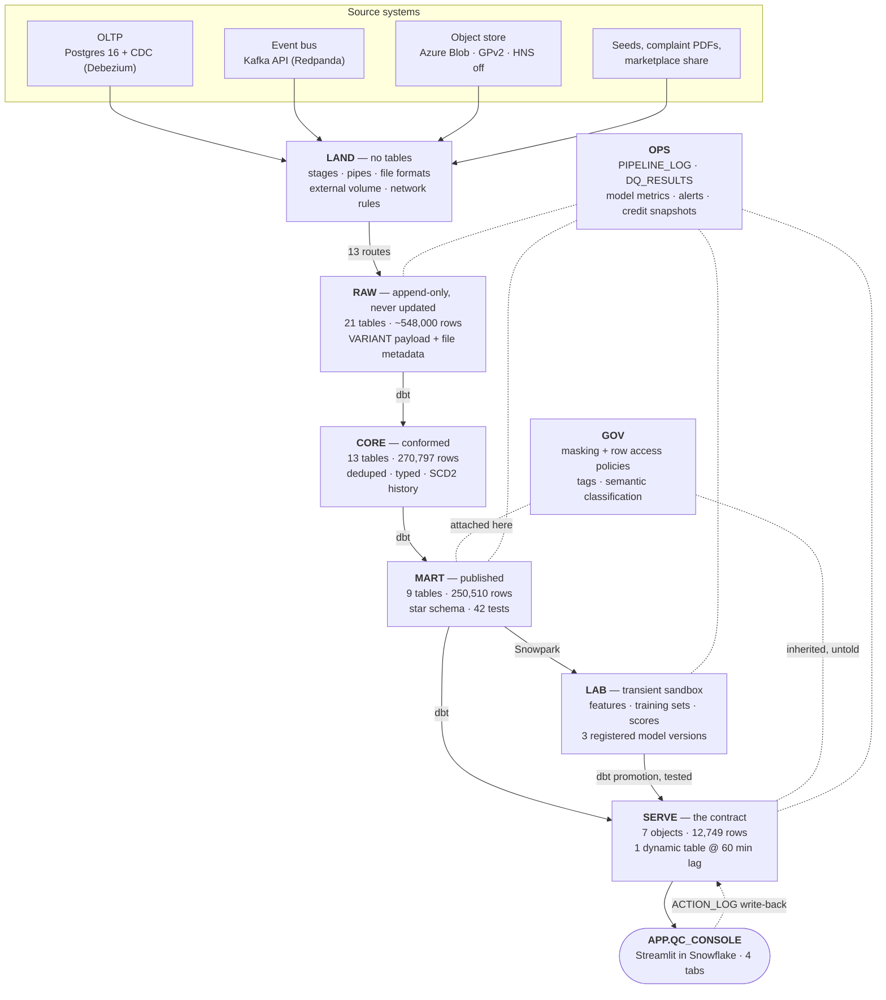

# Snowflake Quick-Commerce PoC — Architecture

Single design document. Domain: quick commerce — dark stores, riders, orders carrying an
SLA `promised_ts`. Deliberately wide scope: touch as many Snowflake-native capabilities
as fit inside one coherent pipeline, plus dbt, Snowpark and Streamlit.

Throwaway build. Optimised for *working and demonstrable*, not durability. Small data on
purpose — if a step needs more than a few hundred MB, the design is wrong.

---

## 0. The system in one pass

An operator runs 8 dark stores. 20,000 orders over 60 days, each carrying a
`promised_ts` 10 to 25 minutes after placement; 16.4% of them miss it. Every
object in this document exists to find those orders before the customer does,
and to make the resulting analysis both trustworthy and cheap to run.

**Status on 2026-09-14: twelve of fifteen stages built and verified.** Ingestion
(13 of 14 routes), conformance, the dimensional model, two models, the
application layer and governance are done. Outbound sharing, CI/CD and the
closing cost report are not. Orchestration (§7) is design only — it was never
built and nothing noticed, because every stage was driven by hand.

One database, `QCOMMERCE`. Nine schemas, and the schema an object lives in *is*
the statement of who may read it — that is the whole access design, not a naming
convention on top of one.



Left to right is the data path. `GOV` and `OPS` are not stages in it — they
attach sideways to every layer, which is the point of both.

| Edge | Mechanism | The constraint that makes it that way |
|---|---|---|
| sources → `LAND` → `RAW` | 13 ingestion routes (§5) | `RAW` is append-only and carries `METADATA$FILENAME` / `LOAD_TS`, so a bad load is reversible without a reload. **Dedupe in `CORE`, never `RAW`** |
| `RAW` → `CORE` → `MART` | dbt | anything expressible in SQL belongs to dbt. `CORE` is the only reader of `RAW` |
| `MART` → `LAB` | Snowpark | needs sklearn or row-wise Python state. `LAB` is `TRANSIENT` — no Fail-safe, cheaper, and disposable on purpose |
| `LAB` → `SERVE` | a dbt model that re-tests | a **promotion**, not a reference. Nothing downstream may name a `LAB` object |
| `SERVE` → app | Streamlit reads `SERVE` and nothing else | one surface to attach policies to, instead of nine |
| app → `SERVE` | `SERVE.ACTION_LOG` | operator decisions become data. A later dbt model joins decisions to outcomes, so the app's own history is a feature |
| `GOV` → `MART` | masking and row access policies on base tables | a policy attached at the base travels every path above it. `SERVE.ORDER_RISK` and the app inherit `RAP_STORE` without being told |
| `OPS` ← everything | append-only logs | `OPS` is written by every layer and read by the operator; nothing reads it back into the pipeline |

**The rule that defines this architecture: `LAB` is a sandbox, `SERVE` is a
contract.** Everything else in the document is a consequence of holding that
line — including the `SERVE` restructuring in §16 (Part 11), where the dynamic
table underneath was split and rebuilt and the app's contract did not change.

### What runs, and on what

| | |
|---|---|
| Compute | three XS warehouses — `WH_INGEST_XS`, `WH_TRANSFORM_XS`, `WH_APP_XS`. `AUTO_SUSPEND = 60`, `GENERATION = '1'`, query acceleration off. Never resized |
| Always on | pipes and streams only. Both are serverless and idle at zero |
| Scheduled | tasks gated by `SYSTEM$STREAM_HAS_DATA(...)`; one dynamic table at `TARGET_LAG = 60 minutes`; one data metric function schedule |
| On demand | dbt, Snowpark training, the app |
| Attribution | every session sets `QUERY_TAG`; credits per part come back from `QUERY_ATTRIBUTION_HISTORY` (§16, Part 12) |

Nothing in the design runs 24/7, and nothing leaves the account: models are
trained inside it, the app executes inside it, and no data is copied out to be
processed elsewhere.

---

## 1. Account facts and the three findings that shaped this

> **Two kinds of surprise, and they want different responses.** The three
> findings below are **tier gates**: a capability is absent and the only honest
> move is to record it and route around. Separately, this account has produced
> two **version skews**, where a capability is present but a catalogue
> misdescribes it — the Model Registry's inference function demanding
> `snowflake-ml-python >=2.0,<3` from a channel carrying 1.9.2 (§11), and
> `INFORMATION_SCHEMA.PACKAGES` advertising streamlit 1.52.2 to an app runtime
> executing 1.22.0 (§16, Part 11). Skews remove nothing and both were worked
> around inside a day, but they are invisible to every `SHOW` and every
> catalogue table, so they are only ever found by running the thing.

| Item | Value |
|---|---|
| Snowflake org / locator | `AWTTGVH` / `OOB49311` (Snowsight URL says `olb61128` — that is the account *name*, the locator differs) |
| Region | `AWS_US_WEST_2` · version `10.31.103` |
| Account created | 2026-08-27 |
| Azure | subscription `d27ba827-26e0-419a-bc0b-2b1015e641bb`, tenant `vikassingh0593gmail.onmicrosoft.com`, region `westus2`, RG `rg-qcpoc` |
| Pre-existing SA `snowflakefreeedition` | in RG `databricksfreeedition`. **Not ours.** Reuse only if `location = westus2` **and** `isHnsEnabled = false` |

### Finding 1 — Cortex AI functions are *mostly* unavailable

> **Corrected on 2026-09-14, by the billing record rather than by a probe.**
> This finding read "AI functions are unavailable" for six parts. Two of them
> were never unavailable. The original text and how it failed are kept below,
> because the failure is more useful than the correction.

Both required grants are present (`USE AI FUNCTIONS` at account level,
`SNOWFLAKE.CORTEX_USER` database role) and twelve of fourteen functions still fail:

> `399258 (0A000): AI function AI_CLASSIFY is not available for trial accounts.`

Measured by calling all fourteen, `sql/p12_ai_recheck.sql`:

| Function | Verdict | The gate names |
|---|---|---|
| `AI_AGG` | **works** | — |
| `AI_SUMMARIZE_AGG` | **works** | — |
| `AI_COMPLETE` | gated | `_COMPLETE_WITH_PROMPT_HISTORY_LLM` |
| `AI_SIMILARITY` | gated | `_AI_EMBED_WITH_PROMPT_1024` |
| `AI_EMBED` | gated | `_AI_EMBED_WITH_PROMPT_768` |
| `AI_FILTER` | gated | `_AI_FILTER_WITH_PROMPT` |
| `AI_EXTRACT` · `AI_SENTIMENT` · `AI_CLASSIFY` | gated | `_AI_EXTRACT` · `_AI_SENTIMENT` · itself |
| `SNOWFLAKE.CORTEX.` `SENTIMENT` · `SUMMARIZE` · `COMPLETE` · `EMBED_TEXT_768` · `TRANSLATE` | gated | themselves |

**The gate is on the underlying primitive, not the surface function.**
`AI_SIMILARITY` is refused as `_AI_EMBED_WITH_PROMPT_1024` — it is an embedding
call wearing a different name, and the refusal says so. That is why the two
aggregates survive: they reach something the gate does not cover. Whether that
is a carve-out or an inconsistency is **UNVERIFIED**; what is measured is that
two LLM-backed functions run on an account documented as having none.

The gate is still the **account type**, not the edition and not a privilege, and
everything needing embeddings goes with it: Cortex Search, Cortex Analyst,
CoWork, and Semantic View Autopilot — Autopilot is GA and edition-independent
but generates DDL with an LLM. Only a conversion to a paid account lifts it.

#### How this was wrong for six parts

The Part 0 probe tested each function and recorded a verdict per function. This
finding recorded a conclusion about the *account*: nine refusals became
"everything downstream of an LLM goes with it", and two successes in the same
run did not survive the summary. `AI_AGG` and `AI_SUMMARIZE_AGG` were never in
the list of nine — their absence read as untested rather than as unrecorded.

Nothing re-reading the probe would have caught it. The correction came from
`ACCOUNT_USAGE.CORTEX_AI_FUNCTIONS_USAGE_HISTORY`, which had been carrying the
contradiction since the day the probe ran:

```
FUNCTION_NAME     QUERY_TAG   TOKENS  CREDITS      IS_COMPLETED
AI_AGG            p00:probe   163     0.00030155   True
AI_SUMMARIZE_AGG  p00:probe   181     0.00033485   True
```

**The spend is a harder test than the probe.** A probe reports what it believes
it observed; billing reports what the platform actually did, and it has no
opinion about what ought to have worked. This is the same failure as the Part 12
data metric function — the probe reported the schedule as available because the
`ALTER` succeeded, testing the statement rather than the outcome — arriving from
the opposite direction: here the statement succeeded and the *summary* discarded
it.

**What it cost.** Part 10 classified 300 complaints with TF-IDF and logistic
regression on the basis of this finding, and that classifier scores 5.41% on
genuinely novel phrasings — below a uniform guess over ten classes (§16, Part
10). `AI_CLASSIFY` is genuinely gated, so the classifier could not have been
built the obvious way. But `AI_AGG` takes a free-text instruction, and an
aggregate over a single-row group is a scalar. **The comparison Part 10 never
ran is still available** and costs roughly 0.05 credits at the observed rate of
0.0003 per ~170 tokens.

### Finding 2 — the account is Enterprise-shaped, not Standard

`SHOW MASKING POLICIES`, `SHOW ROW ACCESS POLICIES`, `SHOW AGGREGATION POLICIES` and
`SHOW MATERIALIZED VIEWS` all resolve; `ACCOUNT_USAGE.ACCESS_HISTORY` reads. Confirm with
a `CREATE MASKING POLICY` in a throwaway database before relying on it — a `SHOW` that
returns an empty set is not proof.

**Net effect.** Almost all of the AI layer left; the governance layer arrived. Section 12
is where this project now does its most interesting work, and it is stronger than the AI
layer would have been: every control is built twice, the Enterprise way and the Standard
way, and compared. The two surviving AI functions (§1 Finding 1) do not change that —
they arrived as a correction to the record six parts after the fact, not as a capability
anything was built on.

---


### Finding 3 — external access is blocked, and the block is not about edition

`CREATE EXTERNAL ACCESS INTEGRATION` returns `509009 (0A000): External access is
not supported for trial accounts.` Mechanism 11 cannot be built here.

The shape of the failure is the useful part:

| Object | Result |
|---|---|
| `CREATE NETWORK RULE NR_OPEN_METEO` | created |
| `CREATE SECRET SEC_WEATHER_CLIENT` | created |
| `CREATE EXTERNAL ACCESS INTEGRATION` | **refused** |

Both building blocks are Enterprise features and both work. What is gated is the
object that binds a rule and a secret to a function — the only one that actually
opens egress. So this is not an edition limit dressed up as a trial limit, and
it is not a grant that was missed. Two of the three findings on this account are
trial gates on capabilities that are not edition features at all, which is worth
stating plainly: **on a trial account, `SHOW GRANTS` will never explain why
something does not work.**

Mechanism 11 stays in the repo as design rather than dead code, the same
treatment Snowflake Datastream gets in §5. `sql/p6_external_access.sql` runs as
far as the wall and stops there.

Weather per store was mechanism 11's payload, not a dependency of anything
downstream — §10's risk features are distance, hour, store load, basket size and
rider. Nothing else is blocked by this.

---

## 2. Layers

Database `QCOMMERCE`. `PUBLIC` dropped.

| Schema | Shape | Written by | Read by |
|---|---|---|---|
| `LAND` | stages, pipes, file formats, external volume, network rules. **No tables** | — | pipes, `COPY` |
| `RAW` | 1:1 with source, append-only, `VARIANT` payload, never updated | pipes, `COPY`, procs | dbt only |
| `CORE` | conformed, deduped, typed, SCD2 history | dbt | dbt, Snowpark |
| `MART` | star schema, published and governed | dbt | analysts, Snowpark, Streamlit |
| `LAB` *(transient)* | features, training sets, model output. Ungoverned sandbox | Snowpark | **nothing downstream** |
| `SERVE` | scored output, aggregates, app write-back | dbt (promotes from `LAB`), Streamlit | Streamlit, Snowsight |
| `SEMANTIC` | semantic views | analysts, the app's Ask tab |
| `APP` | Streamlit artefacts | — | — |
| `OPS` | `PIPELINE_LOG`, `DQ_RESULTS`, credit snapshots, alert history | everything | operator |

**The rule that defines this architecture: `LAB` is a sandbox, `SERVE` is a contract.**
Nothing downstream may reference a `LAB` object. Model output reaches `SERVE` only via a
dbt model that applies tests. Streamlit never reads `RAW`, `CORE` or `LAB`.

`LAB` is `TRANSIENT` — no Fail-safe, cheaper, and its disposability is the point.

---

## 3. Ownership

| Technology | Owns | Does not own |
|---|---|---|
| Snowflake native (pipes, streams, tasks, dynamic tables) | `LAND` → `RAW`, all scheduling | any business logic |
| **dbt** | `RAW` → `CORE` → `MART`, and `LAB` → `SERVE` promotion | ingestion, training |
| **Snowpark** | `LAB` (features, training, scoring, UDFs) + dbt Python models in `MART` | anything expressible in SQL |
| **Streamlit in Snowflake** | `SERVE` only | `RAW`, `CORE`, `LAB` |

Boundary test: expressible in SQL → dbt owns it. Needs sklearn or row-wise Python state →
Snowpark owns it. Needs a schedule → a Snowflake task owns it, not cron, not Airflow.

---

## 4. Source system, volumes, contracts

Postgres 16 in Docker is the OLTP source: `dark_stores`, `customers`, `products`,
`riders`, `inventory`, `orders`, `order_items`. Debezium CDC via logical replication.
**`REPLICA IDENTITY FULL` on every replicated table** so the WAL carries full pre-images
and SCD2 can tell which attribute changed.

| Entity | Rows | Produced by |
|---|---|---|
| dark_stores / products / customers / riders | 8 / 200 / 500 / 60 | Python → Postgres |
| orders / order_items | 20,000 / ~55,000 | Python → Postgres |
| order status events | ~100,000 | Python → Kafka |
| rider GPS pings | ~200,000 | **in-Snowflake `GENERATOR`** |
| clickstream | ~50,000 | **in-Snowflake `GENERATOR`** → NDJSON.gz → Azure |
| complaints | 300 | dbt seed CSV |

Money is **integer paise** everywhere — never float, never `NUMERIC`. It survives JSON,
Kafka, `VARIANT` and Snowpark without a rounding argument.

### Event contracts

`qc.order_status`, one event per lifecycle transition:
```json
{ "event_id": "uuid", "order_id": 918273, "store_id": 12, "rider_id": 4471,
  "from_status": "PACKED", "to_status": "PICKED_UP",
  "event_ts": "2026-09-08T14:22:31.412Z", "source": "rider_app",
  "meta": { "app_version": "4.11.2", "network": "4G" } }
```

`qc.rider_ping`, GPS at ~1 per rider per 5s, **keyed by `rider_id`** so a rider's pings
stay ordered inside one partition:
```json
{ "ping_id": "uuid", "rider_id": 4471, "order_id": 918273,
  "lat": 28.4595, "lon": 77.0266, "speed_kmph": 23.4, "battery_pct": 61,
  "event_ts": "2026-09-08T14:22:33.001Z" }
```

Three rules baked into both:
1. `event_ts` is ISO-8601 UTC with milliseconds, stamped by the **producer**.
2. Every event carries its own idempotency key — Snowpipe Streaming is at-least-once, so
   dedupe is the consumer's job.
3. Open-ended detail lives in a nested `meta` object, so a new field never breaks the
   contract or the `COPY`.

---

## 5. Ingestion — 14 mechanisms

| # | Mechanism | Source | Notes |
|---|---|---|---|
| 1 | **Snowpipe Streaming** via **Kafka Connector v4** + Redpanda | `qc.rider_ping`, `qc.order_status` | v4.1.0, class `SnowflakeStreamingSinkConnector`. Rewrite on the Snowpipe Streaming High-Performance Architecture: up to 10 GB/s per table, 5–10 s end to end, exactly-once and ordered. Schematization **forced OFF** — v4 flipped that default to `true`, so it must be set explicitly to get `RECORD_METADATA` / `RECORD_CONTENT` |
| 2 | **Snowpipe Streaming SDK**, direct, no Kafka | order status events | demonstrates channels and offset tokens |
| 3 | **Kafka connector in Snowpipe file mode** | same topic, second sink | **Needs connector v3.5.4** (`SnowflakeSinkConnector`): v4 dropped file mode entirely and supports streaming only, so the two mechanisms are two connector generations running side by side in isolated plugin directories. `buffer.flush.time = 60s` against streaming's 5–10 s is the measurement. **The comparison is the deliverable, not the ingestion** |
| 4 | **Snowpipe auto-ingest** via Event Grid → Storage Queue | hourly gzipped NDJSON clickstream → `landing/` | |
| 5 | **Snowpipe REST** (`insertFiles`) | same clickstream, internal stage | auto-ingest does not work on internal stages — showing both is the point |
| 6 | **Bulk `COPY INTO`** from the Azure stage | Parquet order backfill | exercises `INFER_SCHEMA`, `MATCH_BY_COLUMN_NAME`, `ON_ERROR`, `VALIDATION_MODE` |
| 7 | **Schema evolution on `COPY`** | v2 file gains `coupon_code` mid-load | `ENABLE_SCHEMA_EVOLUTION = TRUE`. Deliberate and documented |
| 8 | **External table** over `external/` + insert-only stream | 3PL settlement CSVs | queried in place |
| 9 | **Iceberg table** on `EXVOL_QC` | archived order events | **create at `FORMAT_VERSION = 3`** (GA 2026-05-07). v2→v3 is irreversible and v2 readers cannot read v3, so do not create v2 and upgrade |
| 10 | **Directory table + unstructured** | complaint PDFs in `docs/` | feeds document parsing |
| 11 | **External network access** from a Python proc | Open-Meteo weather per store lat/lon | network rule + external access integration + secret. No external tool anywhere in the loop |
| 12 | **Marketplace share** | one free public dataset | zero-copy: ingestion with no ingestion |
| 13 | **`write_pandas`** | store→zone reference mapping | |
| 14 | **dbt seeds** | category hierarchy, SLA thresholds, complaints CSV | version-controlled business constants |

Every `RAW` table carries `METADATA$FILENAME`, `METADATA$FILE_ROW_NUMBER`,
`METADATA$FILE_LAST_MODIFIED` and `LOAD_TS` where the mechanism allows — this is what
makes a bad load reversible without a full reload. **Dedupe in `CORE`, never `RAW`.**

### Azure surface

| Container | Used by | Role granted to the Snowflake service principal |
|---|---|---|
| `landing` | Snowpipe auto-ingest | Storage Blob Data Reader |
| `archive` | Iceberg external volume `EXVOL_QC` | **Storage Blob Data Contributor** (writes) |
| `external` | external table | Storage Blob Data Reader |
| `docs` | directory table | Storage Blob Data Reader |
| `snowpipe-queue` | Event Grid → Snowpipe notification | Storage Queue Data Contributor |

Plain GPv2, **hierarchical namespace OFF**. With HNS on, the Iceberg `dfs` endpoint was
Preview as of March 2026 and `COPY … PURGE` fails because Azure only deletes empty
directories. Use `azure://`, never `https://`.

Three integration objects — external volume, storage integration, notification
integration — each requiring `DESC` → `AZURE_CONSENT_URL` → tenant-admin consent → RBAC
on the resulting enterprise application. RBAC propagation takes ~5 minutes.

**Hard gate:** `SELECT SYSTEM$VERIFY_EXTERNAL_VOLUME('EXVOL_QC');` must pass before any
Iceberg work.

**Not attempted:** Snowflake Datastream — Kafka wire protocol without Kafka underneath,
landing topics as governed Snowflake or Iceberg tables. Private preview, not obtainable
on this account. Covered as prose, not code.

---

## 6. Streams — five types, one each

| Type | Tracks | On | Why that one |
|---|---|---|---|
| Standard | inserts, updates, deletes with before-images | `CORE` SCD2 sources | SCD2 needs the before-image |
| **Append-only** | inserts only | `RAW.RIDER_PING` | cheaper; pings are never updated |
| **Insert-only** | new files | external table | the only mode external tables support |
| On a **directory table** | new files in a stage | complaint PDFs | triggers parsing on arrival |
| On a **view** | changes flowing through a view | `CORE` conformance layer | change tracking without materialising |

---

## 7. Orchestration

> **DESIGN, NOT AS BUILT. This section was never built.**
> `SHOW TASKS IN DATABASE QCOMMERCE` returns zero rows (2026-09-14). The only
> task on the account is Snowflake's own `CORTEX_BASE_MODELS_REFRESH_TASK` in
> `SNOWFLAKE.MODELS`. Ingestion runs on pipes, transformation on dbt invoked by
> hand, and the one scheduled object that exists is the dynamic table in §16
> Part 11. Everything below — the `FINALIZER`, the return-value handoff, the
> stream gate, the serverless-versus-warehouse credit comparison — is intent
> that nothing in the account implements. It went unnoticed for five parts
> because no downstream step needed it: dbt and Snowpark were driven by hand
> at every stage, so the absence never produced a symptom.

| Capability | Where it earns its place |
|---|---|
| **Serverless vs warehouse tasks** | one DAG branch each way, credits compared in `OPS` |
| **`FINALIZER` task** | runs after the DAG **regardless of outcome** — the correct place to write the run summary to `OPS.PIPELINE_LOG` |
| **`SYSTEM$SET_RETURN_VALUE` / `SYSTEM$GET_PREDECESSOR_RETURN_VALUE`** | pass row counts and watermarks between tasks |
| **`WHEN SYSTEM$STREAM_HAS_DATA(...)`** | gates every stream-fed task. Largest single credit saving in the design — a gated task that does not run costs nothing |
| **Snowflake Scripting** | the ingest error handler is a SQL procedure with a cursor and an `EXCEPTION` block, not Python |
| **`EXECUTE AS OWNER` vs `CALLER`** | the privilege model behind the secure-view layer |
| **Three stage types** | table stage `@%tbl`, user stage `@~`, named stage `@LAND.STG_X` |
| **`VALIDATE()` + `COPY_HISTORY`** | post-load inspection after a deliberate bad-file load |
| **Clustering + `SYSTEM$CLUSTERING_INFORMATION`** | on `FCT_RIDER_PING`, depth recorded before and after |
| **Query tags + `QUERY_ATTRIBUTION_HISTORY`** | per-component credit attribution. Costs nothing |
| **Zero-copy clone + `UNDROP`** | clone `MART` → `MART_DEV` for CI; recovery demo inside the retention window |

Resume child tasks before the root, and the root last. A suspended child in a resumed DAG
fails silently.

---

## 8. SQL capabilities used deliberately

| Capability | Where it earns its place |
|---|---|
| **`ASOF JOIN`** | attach each rider ping to the order-status event in force at that moment. The best natural fit in this dataset — the window-function version is 20 lines |
| **`MATCH_RECOGNIZE`** | funnel `PLACED → PACKED → PICKED_UP → DELIVERED`, flagging skipped or out-of-order transitions. Also rider dwell: a run of pings under 2 km/h |
| **`GEOGRAPHY` + `ST_DISTANCE` / `ST_DWITHIN`** | run **beside** the Snowpark haversine UDF; document the accuracy and cost difference |
| **H3** (`H3_LATLNG_TO_CELL`, `H3_GRID_DISK`) | dark-store catchment; ping-density heatmap for the app |
| **`VECTOR` + `VECTOR_COSINE_SIMILARITY`** | "complaints similar to this one" — embeddings come from Snowpark, not Cortex |
| **`QUALIFY`** | dedupe streaming events by `event_id` in one line |
| **`GENERATOR` + `SEQ4` + `UNIFORM`/`NORMAL`** | generate pings and clickstream *inside* Snowflake. Saves an hour and shows a technique most people never find |
| **`FLATTEN` / `LATERAL` / `PARSE_JSON` / `TRY_CAST` / `OBJECT_CONSTRUCT`** | every `RAW` → `CORE` model |
| **`MERGE` + multi-table `INSERT`** | SCD2 upserts where dbt snapshots do not fit |
| **`TABLESAMPLE`** | cost control before any expensive full-table pass |
| **Recursive CTE** | product category tree from the seed |

---

## 9. Dimensional model — `MART`

Built by dbt, surrogate keys via `dbt_utils`.

**Dimensions:** `DIM_DATE` (static, Indian holiday flags from a seed) · `DIM_CUSTOMER`
(**SCD2**: segment, home_pincode) · `DIM_PRODUCT` (**SCD2**: price, is_active) ·
`DIM_STORE` (SCD1, carries lat/lon) · `DIM_RIDER` (**SCD2**) · `DIM_WEATHER_HOUR` (SCD1) ·
`DIM_ORDER_STATUS` (static seed, canonical lifecycle order)

| Fact | Grain | Type |
|---|---|---|
| `FCT_ORDER` | one row per order | **accumulating snapshot** — milestone timestamps as columns, lags between them, SLA breach flag, weather and complaint attributes |
| `FCT_ORDER_ITEM` | one row per order line | transaction |
| `FCT_ORDER_STATUS_EVENT` | one row per transition | transaction, from streaming |
| `FCT_RIDER_PING` | one row per ping | transaction, high volume, clustered on `(event_date, rider_id)` |
| `FCT_INVENTORY_DAILY` | store × product × day | **periodic snapshot** |
| `FCT_COMPLAINT` | one row per complaint | transaction, ML-enriched |

**Three fact patterns in one model — transaction, periodic snapshot, accumulating
snapshot — is a deliberate design point.** `FCT_ORDER` is the accumulating snapshot
because an order's row is rewritten as it walks the lifecycle; `FCT_ORDER_STATUS_EVENT`
keeps the immutable transition log beside it. Both exist on purpose: the snapshot answers
"how long from PACKED to PICKED_UP", the event table answers "which transitions were
skipped".

Max **2 dynamic tables**, `TARGET_LAG >= 60 min`. First is `SERVE.SLA_BY_STORE_HOUR`.

---

## 10. Snowpark — promise-breach risk scoring

Predict, at order placement, whether the order will breach `promised_ts`.

Features in `LAB.FEAT_ORDER`: store load at order time · idle riders within 2 km ·
haversine store→customer distance · weather at placement hour · hour-of-week · basket
size and category mix · store trailing 7-day SLA rate.

| Step | Surface |
|---|---|
| Distance | **UDF** (Python), callable from SQL and Python |
| Rider path smoothing + dwell detection | **UDTF** |
| Preprocessing | Snowpark ML `OneHotEncoder`, `StandardScaler`, `Pipeline` — running *in* Snowflake, not in driver memory |
| Training | **stored procedure**, sklearn `HistGradientBoostingClassifier` on `LAB.TRAIN_SET` |
| Versioning | **Model Registry**, with metrics and signature |
| Features | **Feature Store** — `FEAT_ORDER` registered properly, not left as a bare table |
| Scoring | **vectorized UDF**, open orders every 30 min → `LAB.ORDER_RISK_SCORE` |
| Promotion | dbt model → `SERVE.ORDER_RISK`, with `not_null`, `accepted_range` on probability, and a relationship test to `FCT_ORDER` |

Plus one **Snowpark pandas (Modin)** notebook, showing pandas semantics on warehouse
compute.

> **As built, this is §16 "LAB as built — Part 9".** The design above assumes a
> weather feature, which needs external access and is blocked (§1 Finding 3),
> and a local Snowpark session, which the arm64 gap rules out. Training moved
> inside the account as a stored procedure and the feature set is the four
> drivers the source system actually uses. Feature Store, UDTF and Modin are not
> built.

---

## 11. ML and text — built without Cortex

| Capability | Implementation |
|---|---|
| Demand forecast, store × category × day | `SNOWFLAKE.ML.FORECAST` |
| Ping-volume anomalies per store | `SNOWFLAKE.ML.ANOMALY_DETECTION` |
| Why did SLA drop last Tuesday | `SNOWFLAKE.ML.TOP_INSIGHTS` |
| Complaint → reason code | sklearn classifier, Snowpark sproc, **Model Registry** — see the `embed_local_ml_library` requirement below |
| Sentiment | lexicon UDF, or a second head on the same classifier |
| Order id from free text | **regex UDF** — always the right tool for a numeric id |
| Complaint PDFs from the directory table | **`pypdf`** in a Snowpark UDF |
| "Complaints similar to this one" | feature-hashing vectoriser UDF → `VECTOR(FLOAT, 256)` → `VECTOR_COSINE_SIMILARITY` |
| PII discovery | **`SYSTEM$CLASSIFY`** — restores what Cortex's absence killed |
| Semantic view | hand-written; Autopilot needs an LLM |

`SNOWFLAKE.ML` functions are classical ML, not LLM inference, so the trial AI gate does
not apply — confirmed by training one. `FORECAST` returned a correctly extended trend
and `ANOMALY_DETECTION` created without complaint.

**The Model Registry needs one non-default option on this account.** `log_model` builds
the model's inference function with `snowflake-ml-python >=2.0,<3` as a runtime
dependency and the Anaconda channel carries 1.9.2, so function creation fails with
`391525 ... Packages not found`. Passing `options={"embed_local_ml_library": True}`
ships the library inside the model artefact and there is nothing left to resolve.
Pinning scikit-learn through `conda_dependencies` does **not** fix it — the constraint
comes from the Registry's own dependency, not the model's — and that was established by
running all three variants, not by reasoning about them.

The vector search is **lexical, not semantic**, and the write-up should say so. The
upgrade path is staging `all-MiniLM-L6-v2` (~90 MB) and running it inside the UDF.

**Two ML approaches compared** was a stated goal of the project and survives intact:
SQL-native ML functions versus Snowpark sklearn, on the same data.

---

## 12. Governance — where this project does its most interesting work

Every control built twice, and compared.

| Concern | Enterprise mechanism | Standard substitute | Finding |
|---|---|---|---|
| Column protection | masking policy on `customer_email` | `SHA2()` in a secure view | policy travels with the column; the view protects one access path |
| Row protection | row access policy on `FCT_ORDER` | secure view filtered on `CURRENT_ROLE()` joined to an entitlements table | same shape of difference, one object vs one path |
| Tag-driven protection | **tag-based masking** | — | attach the policy to a tag, not a column; it applies everywhere the tag does. This is what object tags were missing |
| Data quality | **data metric function** | dbt test **and** a Snowpark check writing to `OPS.DQ_RESULTS` | one rule, three expressions, credits compared |
| Lineage | **`ACCESS_HISTORY`** column-level | `QUERY_HISTORY` + `OBJECT_DEPENDENCIES` | column-level vs object-level, and what each misses |
| PII discovery | `SYSTEM$CLASSIFY` | — | classification proposes, secure views enforce |
| Faster point lookup | **search optimization** | clustering key | measure both, then **drop** the search optimization |
| Precomputed aggregate | **materialized view** | dynamic table | measure both, then **drop** the materialized view |
| Alerting | Snowflake Alert on `OPS.DQ_RESULTS` + `SYSTEM$SEND_EMAIL` | — | fire it on a seeded failure |
| Cost | query tags → `QUERY_ATTRIBUTION_HISTORY` | — | per-component credit report |
| Metadata layers | one query each against `ACCOUNT_USAGE`, `INFORMATION_SCHEMA`, `ORGANIZATION_USAGE` | — | document the latency and retention differences |

**Materialized views and search optimization maintain themselves in the background.**
They are exactly the always-on serverless the cost rules exist to prevent: estimate first
(`SYSTEM$ESTIMATE_SEARCH_OPTIMIZATION_COSTS`), build, measure, drop — inside one sitting.

**Multi-cluster warehouses and query acceleration stay out** regardless of edition. No
workload here justifies either, and both are cost traps on a fixed balance.

---

## 13. Serving

| Surface | Note |
|---|---|
| **Reader account** | `CREATE MANAGED ACCOUNT`. Bills to the provider account — create, query, drop |
| **Private listing** | Snowsight → Data Products → Provider Studio |
| **Native App** | application package wrapping the Streamlit app |
| **SQL API** | `POST /api/v2/statements` with a key-pair JWT |

### Streamlit in Snowflake — four tabs

| Tab | Reads | Writes |
|---|---|---|
| **Ops** | `SERVE.SLA_BY_STORE_HOUR` (dynamic table, 60 min lag), H3 density map | — |
| **Risk queue** | `SERVE.ORDER_RISK` joined to `FCT_ORDER`; dispatcher picks reassign / extend promise / issue credit | `SERVE.ACTION_LOG` |
| **Ask** | semantic view through a constrained query builder — pick metric, dimension, filter; show the generated SQL | logged questions |
| **Data health** | `OPS.DQ_RESULTS`, `OPS.PIPELINE_LOG` | — |

A dbt model joins `ACTION_LOG` back to outcomes so the app's own actions become a feature
for the next model run. **That closed loop is the point of the app.**

`QC_ANALYST` sees `SERVE` through secure views, `customer_email` hashed and rows filtered
on `CURRENT_ROLE()`.

---

## 14. CI/CD

Snowflake **Git integration** + Workspaces. GitHub Actions runs `dbt build` against a
zero-copy clone of `MART` on PR, `EXECUTE DBT PROJECT` on merge, and
`EXECUTE IMMEDIATE FROM @git_stage/…` for SQL-file deploys.

The clone is free; `dbt build` on it is not.

---

## 15. Cost model

| Control | Setting |
|---|---|
| Warehouses | `WH_INGEST_XS`, `WH_TRANSFORM_XS`, `WH_APP_XS` — all XS, `AUTO_SUSPEND = 60`, `AUTO_RESUME = TRUE`. Never resized |
| Resource monitor, account | `RM_ACCOUNT`, quota 60, `FREQUENCY = MONTHLY`, notify 50/75/90, **no suspend trigger**. Created 2026-09-14. Covers every warehouse including ones created later |
| Resource monitor, project | `RM_POC`, quota 60, `FREQUENCY = NEVER`, notify 50/75/90, suspend 100/110, attached to the three `WH_*` warehouses. `NEVER` makes its quota a **lifetime** cap rather than a recurring one |
| Account budget | **80 credits**, set and verified. Reachable only by `CALL SNOWFLAKE.LOCAL.ACCOUNT_ROOT_BUDGET!GET_SPENDING_LIMIT()` — there is no `SHOW BUDGETS` and no `ACCOUNT_USAGE.BUDGETS` on this account, which is why the Snowsight page renders empty |
| Account params | `STATEMENT_TIMEOUT_IN_SECONDS = 600`, `DATA_RETENTION_TIME_IN_DAYS = 1` |
| Attribution | `ALTER SESSION SET QUERY_TAG = '<part>:<component>'` on every session |
| Roles | `QC_ADMIN` > `QC_LOADER`, `QC_ENGINEER`, `QC_ANALYST`. Service users `SVC_KAFKA`, `SVC_CI`, both `TYPE = SERVICE`, key-pair only |

**Nothing this project built runs 24/7.** Anything always-on — materialized views, search
optimization, hybrid tables, Snowflake Postgres — is a deliberate short burst, built and
dropped in one sitting. The account is still never quite at zero: Snowflake's own
`CORTEX_BASE_MODELS_REFRESH_TASK` runs daily and an internal `_BACKFILL_TASK` meters as
`SERVERLESS_TASK`. Neither can be stopped and together they are under 0.002 credits.

**No suspend trigger on the account monitor, deliberately.** An account-level monitor that
suspends stops every warehouse at once, including the one needed to investigate why. The
80-credit budget is the backstop above it and `RM_POC` the hard stop below.

See §16, *Cost as measured*, for what the three instruments actually reported and why they
disagree.

Key-pair auth only; no password in any file. `rsa_key*` and `.env` stay out of git;
`dbt_packages/` goes in.

---

## 16. As built — real identifiers and what differed from the design

Everything below is verified, not planned. Design sections above describe intent;
this section is the account as it actually stands on 2026-09-14.

### Identifiers

| | |
|---|---|
| Snowflake account | `AWTTGVH-OLB61128`, locator `OOB49311`, `AWS_US_WEST_2`, version 10.31.103 |
| Connection | `snow -c qcpoc`, `authenticator = OAUTH_AUTHORIZATION_CODE` in `~/.snowflake/connections.toml` |
| Azure subscription | `d27ba827-26e0-419a-bc0b-2b1015e641bb` |
| Azure tenant | `985bb39b-768f-4cc6-ba0f-0f544b826143` |
| Storage account | `snowflakeqcpoc25056`, RG `rg-qcpoc`, `westus2`, GPv2, HNS off |
| Blob principal | `n1fam5snowflakepacint`, object id `5dec4f6c-0618-4fc6-a045-f7549a299115` |
| Queue principal | `14bjnhsnowflakepacint`, object id `a23e7398-bca1-439f-aa8d-7148bae08ea2` |

**Two service principals, not one.** The external volume and the storage
integration share `n1fam5snowflakepacint`; the notification integration gets its
own app with a different client id. Two consent URLs, not three, and not one.

### Deltas from the design

| Designed | As built | Why |
|---|---|---|
| Reuse `snowflakefreeedition` if suitable | Fresh account `snowflakeqcpoc25056` | The existing account is in `eastus2`, not `westus2`. Its HNS flag was unset, which means off — the region alone disqualified it |
| Warehouses as created | `GENERATION = '1'` set explicitly | Gen2 became the default in behaviour-change bundle 2026_03. It accelerates large scans and DML; at 200k rows the bottleneck is warehouse resume and cloud services, so the rate would apply and the benefit would not. Multiplier UNVERIFIED, commonly quoted ~1.35× |
| Warehouses as created | `ENABLE_QUERY_ACCELERATION = FALSE` | On by default. Bills as serverless credits `RM_POC` cannot see |
| `RM_POC` triggers | `NOTIFY_USERS` added | Triggers at 50/75/90% existed with no recipients, so the first real signal would have been the 100% suspend |
| Container-scoped RBAC only | Plus `Storage Blob Delegator` at **account** scope | `generateUserDelegationKey` is an account-scope operation. Without it `SYSTEM$VERIFY_EXTERNAL_VOLUME` returns `success:false` with read, write, list and delete all `PASSED` — a distinctive failure worth recognising |
| `RESOURCE_CONSTRAINT` to set generation | `GENERATION` property | Snowflake rejects the former: *"Use the GENERATION property to set warehouse hardware generation."* |

### Verified

**Enterprise, confirmed by `CREATE` on 2026-09-10.** `CREATE MASKING POLICY`
succeeded in a throwaway database and `SHOW` returned the row. The earlier
`SHOW`-based evidence is no longer the basis for §12 — the feature demonstrably
works. Governance builds every control twice, the policy way and the view way.

`SVC_KAFKA` has `HAS_KEYPAIR = true`, fingerprint
`SHA256:9Z3+0YfSMK7BR5XdA1rZG0ixJBIodMcCMcSMiLZIuOc=`.

```
SYSTEM$VERIFY_EXTERNAL_VOLUME('EXVOL_QC')
  success        true
  write/read/list/delete       PASSED
  azureGetUserDelegationKey    PASSED
  region         westus2
```

`LIST @STG_LANDING` returns zero rows. That is the success case: an empty
container listed without an authorisation error proves the credential works.

### Ingestion as built — 13 of 14

| # | Target | Rows | Note |
|---|---|---|---|
| 1 | `RAW.ORDER_STATUS_KAFKA_V4` | 79,663 | v4.1.0, `SnowflakeStreamingSinkConnector`, `tasks.max = 3` |
| 2 | `RAW.ORDER_STATUS_SDK` | 79,663 | `snowpipe-streaming` 1.8.0, one channel, offset token |
| 3 | `RAW.ORDER_STATUS_KAFKA_V3FILE` | 79,663 | v3.5.4 in a separate plugin dir |
| 4 | `RAW.CLICKSTREAM_AUTO` | 10,051 | Event Grid -> queue -> pipe, 5 files |
| 5 | `RAW.CLICKSTREAM_REST` | 8,097 | `insertFiles` on an internal stage, 4 files |
| 6 | `RAW.ORDER_BACKFILL` | 40,000 | `INFER_SCHEMA` + `MATCH_BY_COLUMN_NAME` |
| 7 | same table | +1 column | `COUPON_CODE` added by the v2 load |
| 8 | `RAW.EXT_SETTLEMENT` | 2,800 | external table, 7 daily files, partitioned on the filename date. Not stored |
| 9 | `RAW.ORDER_EVENTS_ICEBERG` | 79,038 | `ICEBERG_VERSION = 3` at create; 625 rows deleted into a deletion vector |
| 10 | `RAW.COMPLAINT_DOC` | 300 | directory table + `pypdf` UDF; 0 extraction failures, avg 320 chars |
| 11 | — | — | **blocked**: external access is refused on a trial account. See §1 Finding 3 |
| 12 | `RAW.V_FX_INR_USD` | 15,683 | a VIEW over share `MARKETPLACE_PUBLIC_DATA_FREE`. Zero bytes local |
| 13 | `RAW.DIM_STORE_SEED` | 8 | `write_pandas`, `auto_create_table`, types from the dtypes |
| 14 | 4 seed tables | 125 | `dbt build`, `PASS=19 ERROR=0` |
| - | `RAW.ORDER_BADFILE_TEST` | 200 | 203 parsed, 3 rejected, all three named by `VALIDATE()` |

**376,808 rows stored**, plus 2,800 queried in place and 15,683 read live from a
share. `CORE`, `MART`, `SERVE` and `LAB` are empty.

Mechanism 12's listing is `FINANCE__ECONOMICS`, schema **`PUBLIC_DATA_FREE`** —
the Cybersyn rebrand moved it from `CYBERSYN`; table and column names were
unchanged. Its free tier stops at 2026-06-11, a 91-day lag, which is why the
join is `ASOF` rather than an equi-join: the applied rate's date is a column
instead of a silently empty result. Shared tables report `ROW_COUNT` and `BYTES`
as NULL, so a shared table cannot be sized before it is queried.

Both streaming mechanisms created a pipe implicitly behind the target table
(`ORDER_STATUS_KAFKA_V4-STREAMING`, `ORDER_STATUS_SDK-STREAMING`) without either
being declared, which is what gives per-mechanism credit attribution through
`PIPE_USAGE_HISTORY` for free.

### Deltas from the design, Parts 3-5

| Designed | As built | Why |
|---|---|---|
| v4 as shipped | `bc-fips 2.1.3` + `bcpkix-fips 2.1.12` added to the v4 plugin dir | v4 does not bundle BouncyCastle FIPS; v3 does. Without them key-pair auth fails at registration with HTTP 500 |
| v4 compatibility validator on | `snowflake.streaming.validate.compatibility.with.classic = false` | It demands v3 naming and then v3-style client-side validation. Table names here are explicit and schematization is off, so it guarded nothing while costing server-side validation |
| Schematization default | Forced `false` on both connectors | v4 flipped the default to `true`; v3 defaults `false`. Explicit on both, or the two mechanisms are not comparable |
| `VALIDATION_MODE` on the backfill | Moved to a genuinely malformed file | Mutually exclusive with `MATCH_BY_COLUMN_NAME` - Snowflake treats the column match as a transform |
| Compose as written | Named volumes `pgdata`, `rpdata` | `docker compose down -v` destroyed a hand-produced topic with no way to re-snapshot it |

### CORE as built — Part 7

| Object | Rows | Mechanism |
|---|---|---|
| `CORE.ORDER_STATUS_EVENT` | 78,874 | `QUALIFY ROW_NUMBER()` on `event_id`, from 79,663 |
| `CORE.ORDER_HEADER` and six more | 171,403 source rows | CDC envelope shredded, keyed on `COALESCE(after, before)` |
| `CORE.DIM_PRODUCT` | 220 | SCD2, two-part `MERGE`, 200 current + 20 closed |
| `CORE.ORDER_FUNNEL` | 19,029 | `MATCH_RECOGNIZE`, `PATTERN (P K U D)` |
| `CORE.ORDER_CANCELLED` | 623 | `MATCH_RECOGNIZE`, `PATTERN (P K? C)` |
| `CORE.ORDER_LIFECYCLE_ANOMALY` | 348 | neither pattern; classified by status set |

**Mechanisms 1, 2 and 3 carry identical event sets.** Set difference in both
directions returns 0 for all three pairs. Asserted since Part 3, tested in Part
7, and it is what makes taking v4 as canonical defensible rather than merely
convenient.

`RAW` had no dimension sources before Part 7. Only `qc.order_status` had ever
been consumed and that topic is hand-produced rather than captured; the seven
Debezium topics had been sitting unconsumed since Part 3. A second sink
connector landed them, with its own consumer group so the Part 3 benchmark
tables stayed exactly as measured.

### CDC type surprises, measured

| Postgres | Arrives as | Correct cast |
|---|---|---|
| `TIMESTAMP` | VARCHAR, ISO-8601 | `TO_TIMESTAMP_NTZ(x::STRING)` |
| `DATE` | INTEGER, days since epoch | `DATEADD(day, x::INT, '1970-01-01')` |

Same connector, same settings. `20353` is `2025-09-22`, and `::DATE` on it
yields 1970 without raising.

### Streams — all five types exist

`CORE.STR_PRODUCT_CHANGES` standard · `CORE.STR_EVENTS_APPEND` append-only ·
`RAW.STR_SETTLEMENT_NEWFILES` insert-only · `RAW.STR_DOCS_NEWFILES` directory
table · `CORE.STR_ORDER_ENRICHED` on a view.

A stream on a view requires `CHANGE_TRACKING` set explicitly on every underlying
table; a stream on a table enables it implicitly.

### MART as built — Part 8

Built by dbt from a pinned image, `CORE` declared as a source rather than a model.
`dbt build --select tag:mart` returns PASS=42 ERROR=0.

| Model | Rows | Fact pattern |
|---|---|---|
| `fct_inventory_daily` | 96,000 | periodic snapshot |
| `fct_order_status_event` | 78,874 | transaction, immutable |
| `fct_order_item` | 54,635 | transaction, SCD2-resolved |
| `fct_order` | 20,000 | accumulating snapshot |
| `dim_date` | 213 | generated spine |
| `dim_customer` / `dim_product` / `dim_rider` / `dim_store` | 500 / 220 / 60 / 8 | SCD1 / **SCD2** / SCD1 / SCD1 |

`fct_order_item` joins `dim_product` on a validity range, so a line carries the
price in force when the order was placed. All 20 price changes post-date every
order, so every line resolves to the pre-rise version — and `price_variance_paise`
exposes catalogue against charged, which no unversioned dimension can show.

**A schema grant is not an object grant.** `GRANT ALL ON SCHEMA CORE` covers
usage and create; it grants nothing on tables inside, and `CORE`'s tables were
created by `ACCOUNTADMIN`. `sql/p8_grants.sql` issues `ON ALL` and `ON FUTURE`
for `CORE`, `RAW` and `OPS` — neither implies the other.

**dbt runs from `dbt/Dockerfile`**, pinned to dbt-core 1.12.4 and dbt-snowflake
1.12.0, so local and the Part 14 CI run the same versions.
`macros/generate_schema_name.sql` stops dbt concatenating `target.schema` with
the custom name.

### LAB as built — Part 9

`QCOMMERCE.LAB`, transient. Target: will this order be delivered after its
`promised_ts`, decided at placement.

| Object | What |
|---|---|
| `LAB.ORDER_FEATURES` | 19,377 rows — one per delivered order. 6 fitting columns, 2 of them placebos |
| `LAB.SLA_BREACH` | registered model, version `V1`, default set |
| `LAB.ORDER_SCORES` | 19,377 scored rows, written by the warehouse-side inference function |
| `LAB.SP_TRAIN_SLA_MODEL()` | fits, evaluates, registers, writes metrics and coefficients |
| `LAB.SP_SCORE_SLA(STRING)` | batch scoring; discovers the probability column names rather than assuming them |
| `LAB.STG_MODELS` | joblib fallback stage. Proven to round-trip, not needed |
| `OPS.MODEL_METRICS` | one row per version per split per metric |
| `OPS.MODEL_COEFFICIENTS` | fitted weight beside the weight the source system used |

**Features are leakage-free by construction.** Everything recorded after
`PLACED_TS` is excluded — the four milestone timestamps, the three leg
durations, `lifecycle_outcome`, and `rider_sk`, the last because rider
availability is a consequence of the same congestion being predicted. CANCELLED
orders are dropped rather than labelled not-breached: they have no delivery
outcome, and labelling them clean teaches the model a fact about the label
definition instead of about the world.

**Features are built in the source generator's own scaling**, so the fitted
coefficients compare directly against the weights that produced the data:

```
-3.05 + 0.85*(dist_km/5) + 0.55*peak + 0.70*(min(load,15)/15) + 0.25*(items/5) + N(0, 0.50)
```

Two placebos with a true weight of zero are fitted alongside the four drivers.
They came out −0.0146 (`F_WEEKEND`) and −0.0509 (`F_COD`). `penalty=None`,
because L2 shrinkage would be indistinguishable from the attenuation the
unobserved noise term causes, and the whole point is to read the coefficients.

| Measured | |
|---|---|
| Split | 45 days train / 15 days test, strictly temporal |
| Train / test | 14,600 at 16.49% breached / 4,777 at 16.12% |
| Test ROC AUC | 0.6479 |
| Calibration | within 0.70 points overall; within 1.4 points across 4,545 of 4,777 test orders |
| Top decile | 34.73% breach vs 7.34% bottom — 4.73×, 2.15× over base |
| `HAVERSINE` vs `ST_DISTANCE` | 0 m difference across 19,377 rows |
| Checks | 12, all passing |

0.6479 is near this problem's ceiling rather than a weak fit: the generator adds
unobserved `N(0, 0.50)` to the logit and then draws the outcome from a
Bernoulli, so a model holding the true coefficients would score similarly.

**A confound worth recording.** Store congestion has a true weight of +0.70 and
its *marginal* breach rate falls across its own quartiles, 17.09% down to
15.73%. Customers route to their nearest store, so a busy store is one whose
customers are close, and distance — worth up to 3.8 in the logit against load's
~0.2 — points the other way and buries it. The multivariate fit recovers the
positive coefficient. A quartile table is description, not evidence.

**Both inference surfaces agree.** Snowpark `ModelVersion.run()` and the SQL
form below hit the same generated function and returned identical probabilities
on every sampled row:

```sql
WITH sla AS MODEL QCOMMERCE.LAB.SLA_BREACH
SELECT sla!PREDICT_PROBA(F_DIST_5, F_PEAK, F_LOAD_15, F_ITEMS_5, F_WEEKEND, F_COD)
FROM   LAB.ORDER_FEATURES;
```

Returns an OBJECT keyed `output_feature_0` / `output_feature_1`.

**Two things flagged UNVERIFIED that turned out to work**: numeric offsets in a
`RANGE` window frame (`RANGE BETWEEN 3600000 PRECEDING AND 1 PRECEDING`), and
the `WITH ... AS MODEL` SQL surface. The self-join fallback for the first stays
in `p9_features.sql` as a comment.

### Text and classification as built — Part 10

300 complaint PDFs, ten reason codes, 60 hand labels, 240 to classify. Built
without Cortex. `AI_CLASSIFY` is gated on this account (§1 Finding 1) so the obvious
route was closed — though the correction to Finding 1 on 2026-09-14 means `AI_AGG` was
available throughout and an LLM comparison was possible. It was not run.

| Object | What |
|---|---|
| `CORE.COMPLAINT` | 300 rows. Header split from prose, line wrap undone, order reference corrected |
| `LAB.COMPLAINT_REASON` | registered model, V1 and V2 — TF-IDF + logistic regression |
| `LAB.COMPLAINT_PREDICTION` | 300 predictions with a max-class probability |
| `LAB.COMPLAINT_VECTOR` | 300 × `VECTOR(FLOAT, 256)` from a feature-hashing UDF |
| `LAB.COMPLAINT_KNN_PREDICTION` | nearest-neighbour classifier, no model artefact |
| `LAB.TEXT_HASH_VECTOR` / `LAB.COMPLAINT_TONE` | Python UDFs — hashing vectoriser, tone lexicon |
| `OPS.COMPLAINT_TRUTH` | answer key, internal stage, evaluation only |

**The answer key is separated by construction, not by convention.** It lives in
`OPS`, reached through a Snowflake internal stage rather than the Azure
container holding the documents, and no statement in `p10_classify.sql` or
`p10_vectors.sql` references it — `grep -v '^--' … | grep -c COMPLAINT_TRUTH`
returns 0. It is regenerated rather than archived, and the loader diffs the
regenerated dbt seeds against the committed ones before uploading, so a drifted
generator stops the load instead of silently scoring the wrong documents.

**Results, held out on 240:**

| | A: TF-IDF + logistic regression | B: hashed vector + 1-NN |
|---|---|---|
| accuracy | 85.42% | 84.58% |
| macro-F1 | 0.7489 | 0.7446 |
| template seen in training | 203 / 203 | 202 / 203 |
| template never seen | 2 / 37 | 1 / 37 |

Majority baseline 29.58%. Memorisation floor 84.58%.

**The headline number is not the finding.** Each reason code is generated from
three sentence templates and the 60 labels cover them unevenly, so 203 of the
240 held-out documents are phrased the way something in training was phrased.
Nine of the ten classes got exactly those right — exactly, not approximately.
On the 37 genuinely novel phrasings the model scores 5.41%, **below the 10% a
uniform guess over ten classes would achieve**, because its errors are
systematic: unseen phrasings route to whatever shares surface vocabulary.

Two methods sharing nothing but the input text land 0.84 points apart with
identical per-class recall on 7 of 10 classes. **The ceiling belongs to the
corpus and the 60-label sample, not to either method.**

**What is operationally usable is the confidence score, not the classifier.**
All 35 errors fall in the lowest confidence fifth; a threshold at 0.235
auto-routes 80% of complaints with zero errors. Agreement between the two
models is the weaker signal — 92.7% on 90.8% coverage — because they fail
identically, returning the same wrong label on all 16 shared errors.

**Cross-validation overestimated macro-F1** (0.7777 against 0.7489) because its
test rows are drawn from the same 60 documents, so every CV test row's template
is in the label pool by construction and the failure mode is invisible to it.
Accuracy matched to half a point; only the macro average exposed it.

**Vectors here are lexical, not semantic.** `VECTOR(FLOAT, 256)` and
`VECTOR_COSINE_SIMILARITY` are native; an embedding model is not. Signed feature
hashing puts complaints close when they share words. The upgrade is staging
`all-MiniLM-L6-v2` inside the UDF, and the distinction belongs in any write-up
rather than in a footnote.

**Sentiment is a lexicon and measures intensity, not polarity** — every
complaint is negative by construction. The per-class table shows the limit:
MISSING_ITEM scores 4.33 against LATE_DELIVERY's 2.41, which orders the word
list rather than operational severity.

**One source bug, corrected downstream.** `gen_complaints.py:38` claims its
order ids resolve against `generate.py`. The ranges do not overlap at all —
900,000–919,999 against 1–20,000 — so every complaint referenced a nonexistent
order. `CORE.COMPLAINT` adds 899,999, a bijection onto the real id space.
Fixing the generator would change every body interpolating an order id and
force all 300 PDFs to be re-uploaded.

**UNVERIFIED and confirmed working:** the Model Registry accepts a text
pipeline with a one-column STRING `sample_input_data` and infers the signature.

### Serving and the app as built — Part 11

`SERVE` had been empty since bootstrap. It now holds the contract the app
reads, and `APP.QC_CONSOLE` is deployed against it.

| Object | Rows | What |
|---|---|---|
| `SERVE.SLA_STORE_HOUR_AGG` | 7,626 | dynamic table, `TARGET_LAG = 1 hour`, **`FULL` since 2026-09-14** — it was `INCREMENTAL` until §12's row access policy made that impossible. See *The governance layer broke the performance layer* below |
| `SERVE.SLA_BY_STORE_HOUR` | 7,626 | view — the ratios, and the name the app knows |
| `SERVE.ORDER_RISK` | 4,777 | the model's TEST window, scored, outcome carried |
| `SERVE.COMPLAINT_TRIAGE` | 300 | routed on the measured 0.235 confidence gate |
| `SERVE.DATA_HEALTH` | 43 | latest result per check, project-wide |
| `SERVE.MODEL_SCOREBOARD` | 6 | every model version and split |
| `SERVE.ACTION_LOG` | — | the only table; written by the app |
| `APP.QC_CONSOLE` | — | Streamlit, 4 tabs, `WH_APP_XS` |

**The app queries `SERVE` and nothing else.** An app reaching into `LAB` pins
the shape of an experimental schema, and the governance work in §12 needs one
surface to attach policies to rather than nine.

**A dynamic table holds additive aggregates; ratios live in a view above it.**
The first version put the whole aggregate in one dynamic table and Snowflake
downgraded it: *"FULL refresh mode was selected because: This dynamic table
contains a complex query."* `ROUND(100.0 * AVG(...))` and `AVG(DATEDIFF(...))`
are not incrementally maintainable — an average cannot be updated from a delta
without its denominator — so every refresh re-aggregated all 19,377 rows.
Split into counts and sums below, division above, `REFRESH_MODE = INCREMENTAL`
stated explicitly so an unmaintainable query fails at `CREATE` rather than
downgrading silently. The platform reported `refresh_mode INCREMENTAL`,
`refresh_mode_reason None`. This spends one of the two dynamic tables the cost
rules allow.

**That held for one day.** The table is `FULL` now, and not by choice — see
below.

The app's contract did not change across that restructuring, which is the
argument for `SERVE` demonstrated rather than asserted.

**The risk queue is a replay and says so on screen.** Every order was delivered
weeks ago. The outcome is carried in the view and hidden behind a control
rather than withheld, because withholding it makes the only useful panel
impossible: acting on the top 100 of 4,777 reaches roughly 35 of ~770 breaches,
about 4.5× an untargeted 100. `ACTION_LOG` is what makes this more than a
dashboard — a later dbt model joins decisions to outcomes so the app's own
history becomes a feature. Verified end to end.

**THE STREAMLIT RUNTIME IS NOT THE ONE THE CHANNEL ADVERTISES.**
`INFORMATION_SCHEMA.PACKAGES` lists streamlit 1.52.2. The app, asked to report
`streamlit.__version__` from inside itself, says **1.22.0** — thirty minor
versions behind. `hide_index` and `column_config` (1.23) and `st.toggle` (1.26)
therefore do not exist in the runtime that executes the app, and the first
deploy died on the first of them with a traceback naming
`DataFrameSelectorMixin` — Snowflake's own wrapper, not Streamlit's.

The app now feature-detects instead: `show_table` tries
`use_container_width` and falls back on `TypeError`; `toggle` resolves
`st.toggle` or `st.checkbox`; the write-back tries `session.sql(params=...)`
and falls back to literals with single quotes doubled. `TypeError` on keyword
binding is raised before any statement reaches the warehouse, so no fallback
can double-draw or double-insert.

**Deploying: the PUT is what ships a code change.** The app resolves `app.py`
from the stage when opened. `CREATE STREAMLIT` is only needed the first time or
when an object property changes — `CREATE OR REPLACE` issues a new `url_id` and
breaks every bookmark.

### The governance layer broke the performance layer

**§11 and §12 were built in isolation and §12 silently broke §11.** Found on
2026-09-14, two days late, by reading `scheduling_state` on a `SHOW DYNAMIC
TABLES` issued for an unrelated reason.

```
002766: Dynamic table 'QCOMMERCE.SERVE.SLA_STORE_HOUR_AGG' is no longer
incrementalizable because of reason 'Change tracking is not supported on
queries with correlated subquery expressions.'. Please recreate the dynamic
table.
```

Five consecutive failures on 2026-09-13, 12:07 to 15:31, then the table
suspended itself. The last success was `INCREMENTAL` at 10:18. **The query
never changed.** *No longer* is the whole message.

A row access policy body **is** a correlated subquery, injected into every
query that touches the protected table. `GOV.RAP_STORE` went onto
`MART.FCT_ORDER` between the last success at 11:15 and the first failure at
12:07, and `SLA_STORE_HOUR_AGG` aggregates `MART.FCT_ORDER`.

**One policy, three consequences, in ascending order of how badly they behave:**

| Object | How it failed | When you find out |
|---|---|---|
| Materialized view on `FCT_ORDER` | refused at `CREATE` | immediately |
| Dynamic table on `FCT_ORDER` | accepted, validated `INCREMENTAL`, then stopped | at the next refresh, in a log nobody reads |
| The application | served 11:15 Wednesday data for **19 h 39 min** | never |

**The create-time check is not blind to policies — it only runs at `CREATE`.**
Proven rather than inferred: re-issuing the identical `CREATE … REFRESH_MODE =
INCREMENTAL` on 2026-09-14 was refused with a **SQL compilation error**, not a
refresh error:

> `SQL compilation error: line 2 at position 5: Change tracking is not supported on queries with correlated subquery expressions.`

So Snowflake *would* have refused this table had it been created after the
policy. An already-created dynamic table is never re-validated when a policy is
attached to its source: it keeps the `INCREMENTAL` mode it was granted and
discovers at the next refresh that the mode is no longer achievable. **The exact
statement refused outright today was already running yesterday, and nothing
revisited it.**

This inverts §11's own design principle. That section declared
`REFRESH_MODE = INCREMENTAL` explicitly *so an unmaintainable query fails at
`CREATE` rather than downgrading silently* — and it did exactly that, once. No
create-time check covers the table underneath changing later.

**Repaired to `REFRESH_MODE = FULL`** (`sql/p12_serve_repair.sql`), which
re-aggregates all 19,377 rows hourly. At this size that is seconds and the
credits round to nothing. **The honest statement is that governance forced the
performance layer back to a full rebuild**, and at a size where that mattered it
would be an architectural conflict rather than a footnote. After the repair:
`refresh_mode FULL`, `scheduling_state ACTIVE`, `last_suspended_on None`, 7,626
rows, four checks green including 19,377 orders summed reconciling exactly to
19,377 delivered.

Rejected alternatives, each of which trades away something §11 or §12 exists to
demonstrate: sourcing the aggregate from `CORE` (`SERVE` stops being governed);
moving `RAP_STORE` onto a view (defeats §12's finding that a base policy travels
every path); dropping the policy (loses the governance layer to save a refresh
mode).

**The general lesson has nothing to do with dynamic tables.** A control attached
to a shared base table changes the queryability of everything above it, and the
things above it were validated against a version of the table that no longer
exists. Nothing in either feature's documentation mentions the other.

### Governance as built — Part 12

All eleven concerns built and measured.

**Capability, by attempting it.** Fourteen isolated attempts in one procedure;
twelve available. Masking policies, row access policies, tag-based masking,
data metric functions and schedules, materialized views, alerts, email
notification integrations, and all three metadata views — `ACCESS_HISTORY`
11,286 rows, `OBJECT_DEPENDENCIES` 266, `QUERY_ATTRIBUTION_HISTORY` 663. The
only gap was `SYSTEM$CLASSIFY`, and the error said *Unknown function* rather
than a privilege refusal, so it is an API that moved:
`EXTRACT_SEMANTIC_CATEGORIES` is where it went and it works.

| Concern | Built | Finding |
|---|---|---|
| Column protection | policy on `MART.DIM_CUSTOMER` + secure view `SERVE.V_CUSTOMER` | the policy travels every path; the view protects one |
| Row protection | `GOV.RAP_STORE` on `FCT_ORDER.STORE_SK` | inherited by `SERVE.ORDER_RISK` and the app, untold |
| Tag-driven | `GOV.PII` with `MASK_NAME` bound to the tag | `FULL_NAME` is masked with no policy of its own |
| PII discovery | `EXTRACT_SEMANTIC_CATEGORIES` → `GOV.CLASSIFICATION_RESULT` | **changed the design** — see below |
| Data quality | DMF, dbt test and SQL check on one rule | the DMF is the only one that runs when nobody runs anything |
| Lineage | `ACCESS_HISTORY` vs `QUERY_HISTORY` vs `OBJECT_DEPENDENCIES` | only the first knows which columns were read |
| Cost attribution | `QUERY_ATTRIBUTION_HISTORY` by `QUERY_TAG` | 0.3844 attributed credits, p09 at 34.7% |
| Search optimization | built, measured, dropped | **1,981,440 bytes scanned before and after** — zero pruning on one partition |
| Materialized view | refused twice, then built elsewhere | **a row access policy makes MVs on that table impossible** |
| *(unplanned)* | `RAP_STORE` also broke the §11 dynamic table | **and that one was not refused — it was accepted, then stopped.** See the section above |
| Alerting | fired on a seeded failure, then dropped | found a check that had been red for two parts |

**Verified by role, not by grant.** `QC_ANALYST` sees `A***********`, a SHA2
hash, `XXXXXXXXX0819`, `28.55` for a coordinate stored as `28.547024`, and
8,444 of 20,000 orders across 3 of 8 stores — 1,977 rows of `SERVE.ORDER_RISK`
where `ACCOUNTADMIN` sees 4,777. Part 8 established that reading a grant proves
nothing; the same applies to reading what `SHOW` says is attached.

**The classifier disagreed in both directions and was right both times.** It
found `HOME_LAT` and `HOME_LON` as QUASI_IDENTIFIER at HIGH confidence, sitting
unprotected — there is one household at six decimal places, so coordinates
re-identify more sharply than a phone number, and they were in the clear
because the hand tagging covered the columns that *look* like PII rather than
the ones that *behave* like it. It missed `PHONE` entirely, because the values
are `+919895660819` and the pattern library keys on North American formats.
**Classification proposes; its silence is evidence about its training.**

The coordinates are protected by rounding to two decimals rather than
redaction, which would break the distance feature the SLA model depends on.
That is the case for masking policies over redaction: the policy returns a
useful transformation and the analysis survives the protection.

**An armed trap, found and defused.** A data metric function attached and
scheduled cleanly, then the catalogue reported an hourly cron still present
after `UNSET DATA_METRIC_SCHEDULE`, suspended only by a missing `EXECUTE DATA
METRIC FUNCTION` privilege. Granting that privilege later for an unrelated
reason would have started an hourly job on a table nobody asked to monitor. The
metric is detached outright. The probe had reported the schedule as available
because the `ALTER` succeeded — **it tested the statement, not the outcome.**

**Policies are created then altered, never replaced.** `CREATE OR REPLACE` is
the idempotent form for most objects and is rejected outright for a policy
attached to anything. Every policy is created with a fail-closed body and
altered into place, so no column is ever attached to a policy that reveals it,
not even between two statements. `SET MASKING POLICY` needs `FORCE`, `ADD ROW
ACCESS POLICY` needs a preceding `DROP ALL`, and `CREATE OR REPLACE TAG`
silently clears every column assignment. **A governance script that runs once
and then aborts is one nobody re-runs**, which is how protection quietly stops
matching intent.

**The two serverless features cost something and returned nothing, and the
free query said so first.** `SYSTEM$CLUSTERING_INFORMATION` reports
`total_partition_count: 1` on `MART.FCT_ORDER`. Both features work by skipping
partitions; with one there is nothing to skip. Measured: 1,981,440 bytes
scanned before and after, identical. The design's order is estimate, build,
measure, drop — **count partitions first, and if there is one, stop.**

A baseline taken without `ALTER SESSION SET USE_CACHED_RESULT = FALSE` is not a
baseline. The first attempt returned `BYTES_SCANNED 0` from the result cache and
would have been reported as a 100% improvement.

**A row access policy and a materialized view cannot coexist on one table.**
`Unsupported feature 'Create Materialized view on entity protected by row
access policy'` — refused outright. Two features documented pages apart, and
the collision surfaces only when both are built. A design reviewed feature by
feature ships both.

**Alerting is the answer to a check log nobody reads.** Forty-odd checks were
green; the drill found one that had been red since Part 10, invisible under a
`LIMIT 6`, and a second that was red because **renaming a check orphans its
last result** in an append-only log. Every check in the project now passes on
its latest run.

**Twelve signature errors in this part**, listed in `PROGRESS.md`, and the
local validation that should have caught them was itself broken — it stripped
`--` comments before string literals, so every `EXPECTED` text containing `--`
corrupted the parse. It reported clean and dirty on correct files alike. Nine reduce  to one mistake: inferring an API's shape from how output
*rendered*, or from what an adjacent feature does. This project probes *capabilities* rigorously — can
this account do X — and was not probing *signatures*. The discipline needs
extending to the exact call rather than the family it belongs to.

### Cost as measured — three instruments, three different totals

The account budget's `GET_SPENDING_HISTORY` is the first instrument in this
project that sees warehouse and serverless together. Reading it beside the other
two contradicted an assumption held since Part 3.

| Instrument | Reports | Over |
|---|---:|---|
| Budget `GET_SPENDING_HISTORY` | **5.410417** | 8 days, all service types, 6.8% of the 80 limit |
| `ACCOUNT_USAGE.METERING_DAILY_HISTORY` | 5.586925 | the same 8 days |
| `RM_POC.used_credits` | 2.55 | warehouse only, and only its own three warehouses, and only since it started |
| `QUERY_ATTRIBUTION_HISTORY` | 0.3844 | tagged query execution only |

**The budget and `ACCOUNT_USAGE` disagree by 0.192815 and the budget is right.**
`CREDITS_ADJUSTMENT_CLOUD_SERVICES` is the exact negative of cloud services on
seven of eight days — the 10% free allowance cancelling it entirely. Only
2026-09-12 bills cloud services, because zero compute that day means zero
allowance to offset. Net of the adjustment `ACCOUNT_USAGE` reads 5.408292
against the budget's 5.394110. **`CREDITS_USED` is not what you pay.**

#### Where the credits actually went

| Warehouse | Total | Monitored | Days |
|---|---:|---|---:|
| **`SNOWFLAKE_LEARNING_WH`** | **3.142465** | **no** | 7 |
| `WH_TRANSFORM_XS` | 1.775760 | `RM_POC` | 5 |
| `WH_APP_XS` | 0.708300 | `RM_POC` | 2 |
| `WH_INGEST_XS` | 0.086368 | `RM_POC` | 6 |
| `CLOUD_SERVICES_ONLY` | 0.001714 | — | 4 |

**A Snowflake-provided default warehouse is the single biggest consumer on this
account** — 55.0% of all warehouse spend, on more days than any warehouse this
project built, entirely unwatched. The three designed warehouses are 45%. Twelve
parts of engineering cost less than whatever ran in `SNOWFLAKE_LEARNING_WH`,
which is what a Snowsight worksheet with no warehouse explicitly selected lands
on. `RM_ACCOUNT` now covers it.

`RM_POC` reconciles exactly once both of its blind spots are applied — three of
six warehouses unassigned, and `FREQUENCY = NEVER` with `start_time 2026-09-09
11:50:26` so it began counting two days into the build: 2.566476 computed
against 2.55 reported. It was never wrong, only narrower than anyone read it as.

#### Three findings that only appear when the instruments are read together

**Idle time is the cost story, not compute.** 0.3844 attributed against 5.3941
metered — **93% of warehouse spend is not attributed query execution.** An XS
warehouse bills 1 credit/hour and `AUTO_SUSPEND` is 60 seconds, so every
isolated statement in an interactive session buys a minute of billed time plus
resume for a few seconds of work, hundreds of times over. **At this scale
batching statements matters far more than warehouse size**, which is the
opposite of the usual advice.

**Serverless was structurally right to worry about and numerically irrelevant.**
0.016307 credits over eight days, 0.30% of the total. `PIPE` totals 0.000113
with four of seven days at exactly zero — two continuously-running ingestion
mechanisms for a rounding error. The cost rules spent real design effort here
and it is worth recording honestly rather than quietly dropping.

**Ingestion barely computed.** `WH_INGEST_XS` spent 0.067757 on cloud services
against 0.018611 on compute — **3.64×**. Thirteen routes of pipes, stages,
`COPY` metadata, `SHOW` and `DESCRIBE` are almost entirely metadata operations,
and metadata does not run on the warehouse.

`QUERY_ACCELERATION` at 0.005849 on 2026-09-08 needs no further query: it
confirms the §16 delta six days after the decision. The feature is on by
default, it did bill as serverless, and setting
`ENABLE_QUERY_ACCELERATION = FALSE` was correct.

### Not yet done

- ~~**Account budget**~~ **DONE, 2026-09-14.** Set at 80 credits and verified by
  calling the object rather than by reading the Snowsight page, which renders
  empty because there is no `SHOW BUDGETS` and no `ACCOUNT_USAGE.BUDGETS` on
  this account. `RM_ACCOUNT` was added alongside it after the budget's own
  history showed that `RM_POC` saw 45% of warehouse spend, not 100%. See *Cost
  as measured* above.
- ~~**Credits backfill**~~ **Superseded.** The budget's `GET_SPENDING_HISTORY`
  answers what `sql/p3_credits_backfill.sql` was written to answer, without the
  `ACCOUNT_USAGE` latency and with the cloud-services adjustment already
  applied. The three instruments and why they disagree are in *Cost as
  measured*. `QUERY_ATTRIBUTION_HISTORY` remains a floor rather than a bill —
  0.3844 against 5.3941 metered, and that 93% gap turned out to be the most
  useful number in the project.
- **Mechanism 11 only, and not by choice.** External access is refused on a
  trial account (§1 Finding 3). 13 of 14 is the ceiling here.
- **The Anaconda gate does not exist on this account.** It was assumed to block
  mechanisms 10 and 11 and there is no such setting on Billing & Terms.
  `sql/p6_pkg_probe.sql` settled it by CREATE rather than by SHOW: `pypdf 6.18.0`
  and `requests 2.34.2` both compiled and executed. Python runtimes 3.8 through
  3.14 are available; UDFs here pin 3.11 because that is the one a real
  execution proved.
- **A native arm64 interpreter.** Mechanisms 13 and 14 sidestepped it by running
  in containers, as mechanism 2 did. Part 9 was expected to need one and did
  not: training moved inside the account as a Python stored procedure, so
  Snowpark and `snowflake-ml-python` never had to run on the Mac. dbt takes the
  container route via `scripts/dbt.sh`. Nothing outstanding now requires it.
- **Outbound serving.** Reader account, private listing and the SQL API are
  Part 13. `SERVE` itself is built — Part 11.
- **Orchestration was never built.** §7 is design. `SHOW TASKS IN DATABASE
  QCOMMERCE` returns zero rows. The `FINALIZER`, the return-value handoff, the
  stream gate and the serverless-versus-warehouse credit comparison are all
  unwritten, and the absence produced no symptom because every stage was driven
  by hand. The one scheduled object that exists is the §11 dynamic table.
- **`sql/p9_report.sql` has never been run.** `corr_dist_load`, `q4_minus_q1`
  and the fitted-versus-generator coefficient table are the one gap in the
  Part 9 write-up.
- **The Part 10 comparison that is now possible.** `AI_AGG` works (§1 Finding
  1), and an aggregate over a single-row group is a scalar. The 300 complaints
  could be classified by an LLM and scored against `OPS.COMPLAINT_TRUTH` for
  roughly 0.05 credits. The TF-IDF classifier scores 5.41% on genuinely novel
  phrasings; an LLM does not share that failure mode. Not run.
- **Parts 13 through 15.** Outbound serving — reader account, private listing,
  SQL API (13), CI/CD (14), the cost model closed out against measured
  credits (15). Parts 10, 11 and 12 are built.

---

## 17. Out of scope

Snowpark Container Services · Notebooks on Container Runtime · ML Jobs · Openflow ·
replication / failover / client redirect · clean rooms · Cortex fine-tuning · Warehouse
Gen2 · Adaptive Compute · Snowflake CoCo (not enabled on this account) · Snowflake
Datastream (private preview) · multi-cluster warehouses · query acceleration.
