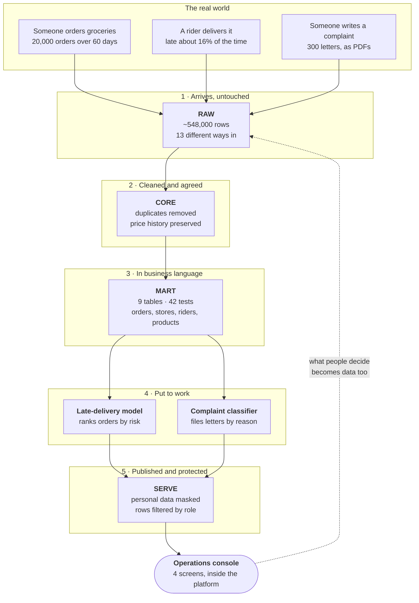

# Quick-Commerce Analytics Platform — Architecture

Companion to `docs/ARCHITECTURE.md` (engineering detail) and `docs/PROGRESS.md`
(build log). This document states what the platform is and what has been built.
Technology is named generically, with the specific product in brackets.

**Status: twelve of fifteen stages complete.** Ingestion (13 of 14 routes),
cleaning, the business model, predictive scoring, text classification, the
application layer and governance are all built and verified. Outbound sharing,
CI/CD and the closing cost report remain.

---

## 0. In plain terms

A company runs eight small local warehouses — "dark stores" — that hold grocery
stock. You order on an app, and the company promises to deliver in 10 to 25
minutes. Sometimes it does not. About one order in six arrives late.

This platform is where all of that ends up so somebody can do something about
it. Three things happen to the data, in order:

1. **It arrives.** Orders, deliveries, stock levels and written complaints
   stream in from the systems that produce them, and are stored exactly as they
   came — nothing corrected, nothing thrown away.
2. **It is cleaned and agreed.** Duplicates removed, dates made consistent,
   prices as they were *at the time* rather than as they are now. One version
   everybody uses.
3. **It is put to work.** Two models read it — one predicts which orders are
   about to be late, one reads complaint letters and files them by reason — and
   a small application puts both in front of the people who act on them.

The last step is the one that matters most, and it is easy to miss: **what those
people decide is written back down.** A dispatcher who reassigns a rider, or a
support agent who corrects a misfiled complaint, is creating the training data
for the next version of the model. The platform is a loop, not a pipeline.

**Nothing leaves.** The models are trained inside the platform, the application
runs inside it, and the data is never copied out to be processed somewhere else.
Personal details are protected where they are stored rather than in each place
they are read, so a query written next year is covered by a rule written today.

---

## 1. Purpose

An analytics platform for a quick-commerce operator — dark stores fulfilling
grocery orders against a delivery promise of 10 to 25 minutes.

| Question | Consumer |
|---|---|
| Which orders in flight will breach their promise? | Dispatcher |
| Which stores miss their promise, at which hours? | Operations |
| Why did the on-time rate move? | Regional management |
| How much stock will each store need? | Supply planning |
| What are customers complaining about? | Customer experience |
| Who may see customer contact details? | Compliance |

Operator decisions on at-risk orders are captured as data and become training
input for later model versions.

---

## 2. Domain and scale

| Entity | Volume |
|---|---|
| Dark stores | 8 (Delhi NCR) |
| Riders | 60 |
| Customers | 500 |
| Products | 200 across 4 categories, 3-level hierarchy |
| Orders | 20,000 over 60 days |
| Order lines | 54,635 |
| Stock snapshots | 96,000 |
| Order status events | 79,663 |
| SLA breach rate | 16.4% |

**Monetary values are stored as integer paise.** No decimal currency anywhere in
the pipeline.

**Deliberate data defects**, injected at generation so downstream handling is
exercised rather than assumed: 1% duplicate events (at-least-once delivery), 2%
skipped or out-of-order status transitions.

---

## 3. Layer architecture

| Layer | Schema | Contents | Rule |
|---|---|---|---|
| Landing | `LAND` | Stages, file formats, pipes, integrations | No data at rest |
| Raw | `RAW` | Data exactly as it arrived | Append-only. No dedupe, no casting, no joins |
| Core | `CORE` | Deduplicated, conformed, SCD2 history | Single place where duplicates are resolved |
| Mart | `MART` | Dimensional model in business vocabulary | Star schema |
| Lab | `LAB` | Experiments, feature engineering, model training | Transient. Unpoliced |
| Serve | `SERVE` | Governed, quality-gated published output | Nothing reaches a consumer without passing tests |
| Semantic | `SEMANTIC` | Metric definitions | |
| App | `APP` | Embedded application objects | |
| Ops | `OPS` | Benchmarks, cost attribution, quality results | |

`LAB` is a sandbox; `SERVE` is a contract. Promotion between them is gated on
automated quality tests.

---

## 4. Component inventory

| Role | Generic technology | Product used |
|---|---|---|
| Operational database | Relational OLTP | PostgreSQL 16 (logical replication) |
| Change data capture | CDC connector | Debezium (`pgoutput`) |
| Event broker | Kafka | Redpanda (Kafka API compatible) |
| Broker → warehouse | Kafka sink connector | Snowflake Kafka Connector v4.1.0 and v3.5.4 |
| Streaming client | Row-level streaming SDK | Snowpipe Streaming SDK |
| Object storage | Cloud blob storage | Azure Blob Storage (GPv2, hierarchical namespace off) |
| Storage event notification | Event bus → queue | Azure Event Grid → Azure Storage Queue |
| Managed file ingestion | Continuous file loader | Snowpipe (auto-ingest and REST) |
| Open table format | Open columnar table format | Apache Iceberg v3 |
| Data warehouse | Cloud data warehouse | Snowflake (AWS `us-west-2`) |
| Transformation framework | SQL transformation + testing | dbt |
| In-warehouse compute | DataFrame / UDF runtime | Snowpark (Python) |
| Machine learning | Classical ML | `SNOWFLAKE.ML` functions and scikit-learn in Snowpark |
| Model management | Model registry | Snowflake Model Registry — versions, metrics, signature, SQL-callable inference |
| Document parsing | PDF text extraction | `pypdf` in a Python UDF |
| Application layer | Embedded data app | Streamlit in Snowflake |
| CI/CD | Pipeline automation | GitHub Actions + Snowflake Git integration |
| Container runtime | Local containers | Docker Compose |

Three components run in containers rather than on the workstation — the
streaming SDK, the DataFrame loader and dbt — because their dependencies have no
wheels for the workstation's CPU architecture.

---

## 5. Object storage layout

| Container | Purpose | Access granted to the warehouse |
|---|---|---|
| `landing` | Files awaiting continuous ingestion | Read |
| `archive` | Open-format table storage | **Read and write** |
| `external` | Partner files queried in place | Read |
| `docs` | Unstructured documents | Read |
| `snowpipe-queue` | Storage event notifications | Queue contributor |

Least privilege by container. The warehouse can write to exactly one of them.
Two separate service principals: one for blob access, one for queue access.

---

## 6. Ingestion routes

Thirteen distinct paths carry data into the platform. Each exists because a
different constraint makes the others wrong.

| # | Route | Implementation | Target | Rows |
|---|---|---|---|---|
| 1 | Kafka → warehouse, streaming | Kafka connector v4, row-level streaming | `RAW.ORDER_STATUS_KAFKA_V4` | 79,663 |
| 2 | Direct streaming, no broker | Streaming SDK, channels and offset tokens | `RAW.ORDER_STATUS_SDK` | 79,663 |
| 3 | Kafka → warehouse, micro-batch files | Kafka connector v3, file mode | `RAW.ORDER_STATUS_KAFKA_V3FILE` | 79,663 |
| 4 | Storage notifies the warehouse | Snowpipe auto-ingest via Event Grid queue | `RAW.CLICKSTREAM_AUTO` | 10,051 |
| 5 | Client notifies the warehouse | Snowpipe REST `insertFiles`, internal stage | `RAW.CLICKSTREAM_REST` | 8,097 |
| 6 | Bulk historical load | `COPY` with schema inference | `RAW.ORDER_BACKFILL` | 40,000 |
| 7 | Source schema change absorbed | Schema evolution on `COPY` | same table | +1 column |
| 8 | Query files without loading | External table + insert-only stream | `RAW.EXT_SETTLEMENT` | 2,800 |
| 9 | Open-format archive | Iceberg v3 on an external volume | `RAW.ORDER_EVENTS_ICEBERG` | 79,038 |
| 10 | Unstructured documents | Directory table + PDF extraction UDF | `RAW.COMPLAINT_DOC` | 300 |
| 11 | Outbound API call from the warehouse | External access integration | — | **not available** |
| 12 | Shared dataset, zero copy | Marketplace share, queried live | `RAW.V_FX_INR_USD` | 15,683 |
| 13 | DataFrame to table | `write_pandas`, table created from dtypes | `RAW.DIM_STORE_SEED` | 8 |
| 14 | Version-controlled constants | dbt seeds with tests | 4 tables | 125 |

Routes 1, 2 and 3 carry **identical input** so their latency and cost can be
compared with the data held constant. That comparison is the deliverable, not
the ingestion.

Route 11 is refused by the account tier. See §13.

---

## 7. Data currently in the platform

| Layer | Rows | Contents |
|---|---|---|
| `RAW` | ~548,000 | 21 tables, exactly as arrived. Includes 171,403 CDC rows |
| `CORE` | 270,797 | 13 tables, typed, deduplicated, versioned |
| Queried in place | 2,800 | Partner files, never copied |
| Read live from a publisher | 15,683 | Marketplace share, never stored |
| `MART` | 250,510 | 9 tables, dimensional model |
| `LAB` | 39,654 | Order features and scores at 19,377 rows each, complaint vectors and two sets of predictions at 300 each, three registered model versions |
| `SERVE` | 12,749 | 7 objects — the governed contract the application reads |

`CORE` in detail:

| Table | Rows | Note |
|---|---|---|
| `INVENTORY_DAILY` | 96,000 | store × product × day |
| `ORDER_STATUS_EVENT` | 78,874 | deduplicated from 79,663 |
| `ORDER_ITEM` | 54,635 | |
| `ORDER_HEADER` | 20,000 | |
| `ORDER_FUNNEL` | 19,029 | complete lifecycles |
| `ORDER_CANCELLED` | 623 | |
| `ORDER_LIFECYCLE_ANOMALY` | 348 | defective sequences, classified |
| `DIM_PRODUCT` | 220 | 200 current + 20 historical versions |
| `CUSTOMER` / `PRODUCT` / `RIDER` / `STORE` | 500 / 200 / 60 / 8 | |

Every order appears in exactly one of funnel, cancelled or anomaly:
**19,029 + 623 + 348 = 20,000**.

The three order-status tables in `RAW` still hold the same events three times
over. That is deliberate — it is what makes the ingestion comparison valid — and
`CORE` resolves it by taking one as canonical, which is defensible because all
three were proved to carry identical event sets.

---

## 8. Predictive scoring

One model, in production shape: given an order at the moment it is placed,
the probability it will be delivered after its promised time.

| | |
|---|---|
| Training | In-database, as a stored procedure. Data never leaves the platform |
| Model storage | Model registry [Snowflake Model Registry], versioned, with metrics and signature |
| Inference | Runs on warehouse compute, callable from SQL or from the Python API — both verified to return identical values |
| Output | `LAB.ORDER_SCORES`, one probability per order |

**Only information available at order placement is used.** The delivery
milestones, the leg durations and the assigned rider are all excluded: each is
recorded after the fact, and a model trained on them would score perfectly in
testing and be worthless in operation. Cancelled orders are excluded entirely
rather than recorded as "not late", because they have no delivery outcome.

The training and test sets are split by **date**, not at random — 45 days to
train, the following 15 to test. A random split lets the model be tested on the
same store-hours it was trained on.

| Measured on 15 unseen days | |
|---|---|
| Orders scored | 19,377 |
| Ranking quality (ROC AUC) | 0.648 |
| Calibration | Predicted late-rate within 0.7 points of actual |
| Riskiest tenth of orders | 34.7% late, against 16.1% overall |
| Safest tenth | 7.3% late |

The operational reading is the last two rows. Ranking orders by risk and acting
on the riskiest tenth reaches orders that are **more than twice** as likely to
be late as an untargeted sample, and **4.7 times** as likely as the safest
tenth. Calibration matters as much as ranking: a score of 0.30 means close to 30
orders in 100, so a threshold can be set against a staffing budget rather than
guessed.

The four drivers the model relies on — distance, time of day, store congestion
and basket size — were confirmed against the known behaviour of the source
system, and two deliberately meaningless inputs were included as controls. Both
came back at effectively zero weight, which is the evidence that the model is
reading signal rather than noise.

---

## 9. Complaint classification

Three hundred customer complaints arrive as PDF documents. Sixty were read and
categorised by hand into ten reason codes. The platform assigns codes to the
other 240.

| | |
|---|---|
| Text extraction | PDF parsing inside the warehouse, on documents read directly from object storage |
| Approach A | Term weighting into a linear classifier, trained in-database and versioned in the model registry |
| Approach B | Text hashed into a 256-dimension vector, classified by nearest neighbour — no model artefact at all |
| Similarity search | Native vector type and cosine similarity: "show me complaints like this one" |
| Evaluation | Against a withheld answer key held in a separate schema no training step can reach |

| Measured on the 240 unseen complaints | A | B |
|---|---|---|
| Correct | 85.4% | 84.6% |
| Balanced across all ten codes (macro-F1) | 0.749 | 0.745 |
| Always guessing the commonest code | 29.6% | 29.6% |

**The accuracy figure overstates what this can do, and the platform is set up
to show that rather than hide it.** The complaints were written from a limited
set of phrasings. Where a complaint is worded like one of the sixty examples,
both approaches are essentially perfect. Where it is worded in a way neither
has seen, both fall to near zero — worse than random guessing, because the
errors are not random: an unfamiliar complaint is filed under whichever
category shares the most ordinary words with it.

Two methods with nothing in common land less than a point apart. That is the
useful conclusion: **the limit is the sixty labels, not the modelling.** More
models will not help. More labels, chosen to cover phrasings the current sixty
miss, will.

**What is usable today is the confidence score rather than the classification.**
Every error the system makes falls in the least-confident fifth of its
predictions. Setting a threshold there routes 80% of complaints automatically
with no errors at all, and sends the remaining 20% to a person. A model that
cannot generalise still produces a working triage rule, because it reliably
signals when it does not know.

Two further capabilities are built and both are labelled for what they are.
Similarity search is **lexical** — it finds complaints sharing words, not
complaints sharing meaning — because a managed embedding model is unavailable
on this account tier. Tone scoring counts words from a fixed list, and since
every complaint is negative by definition it measures **intensity, not
sentiment**; its per-category ordering reflects the word list rather than
operational severity, and it is not presented to users as sentiment.

---

## 10. The operations console

An application inside the platform, so no data leaves it to be displayed. Four
screens, each reading a published, governed view rather than the working tables
beneath it — which means the storage under any of them can be rebuilt without
the application changing.

| Screen | Shows | Records |
|---|---|---|
| Operations | On-time rate by store and by local hour, worst store-hours | — |
| Risk queue | Orders ranked by predicted lateness | The dispatcher's decision |
| Complaints | Auto-routed against needs-a-human, and the review queue | A confirmed or corrected category |
| Health | Every data-quality check, model scores by version, decisions taken | — |

**The risk queue is a replay of past days, and the screen says so.** Every order
in this platform was delivered weeks ago, so a queue of orders in flight would
be a mock-up. Replaying real days is more useful than a mock-up for one reason:
the outcome is already known, so a decision taken on a prediction can be
scored against what actually happened. Acting on the 100 riskiest of 4,777
orders reaches about 35 of the 770 that were late — roughly four and a half
times what picking 100 at random would reach. That number, not the prediction
itself, is what answers whether the score is worth a dispatcher's time.

**Decisions are recorded, and that is the point of the screen rather than a
feature of it.** A dashboard shows numbers; this writes down what somebody did
about them. Those decisions become data, and a later transformation joins them
back to outcomes, so the operator's own judgement becomes an input to the next
version of the model. Without that, a risk score is a suggestion nobody ever
learns from.

**The complaint screen routes on a measured threshold, not a chosen one.** Every
mistake the classifier made on unseen complaints falls below a confidence of
0.235, and everything above it was correct. So the screen auto-files roughly
four complaints in five and puts the rest in front of a person, and the wording
on screen says where the number came from and that retraining the model
invalidates it.

**The hourly aggregate refreshes incrementally**, applying only what changed
rather than recomputing the whole history each time. That required splitting
it: the maintained table holds counts and totals, and the percentages and
averages are computed in a view above it. An average cannot be updated from a
change without also knowing how many rows it covered.

---

## 11. Access model

| Role | Grants |
|---|---|
| `QC_ADMIN` | Owns the database |
| `QC_LOADER` | Writes `LAND` and `RAW` only |
| `QC_ENGINEER` | Full access to transformation and lab schemas |
| `QC_ANALYST` | `SERVE` and `SEMANTIC` views only. No base-table access anywhere |

Two service accounts, both typed as service accounts and both **key-pair
authentication only**. No password exists in any file or configuration. Private
keys are excluded from version control.

Each control is built **twice** and compared: once attached to the data itself,
and once approximated with a restricted view. The difference is not academic. A
policy attached to a column applies down every path to that column, including
paths written before the policy existed. A restricted view protects the one
path through it, and anyone who queries around it is unaffected.

That was demonstrated rather than argued. The order-risk view the application
reads was built before any row-level rule existed, and when the rule was
attached to the underlying order table the application's view narrowed with it
— 4,777 rows to 1,977, eight stores to three — with no change to either.

| Seen by an analyst | Stored |
|---|---|
| `A***********` | full name |
| a 64-character hash | email address |
| `XXXXXXXXX0819` | full phone number |
| `28.55` | `28.547024` |

Hashing rather than blanking is deliberate: the same customer hashes the same
way every time, so an analyst can still count and group by customer without
ever seeing one. Coordinates are rounded to about a kilometre rather than
removed, because removing them would break the delivery-distance calculation
the risk model depends on — protection that destroys the analysis has not
solved the problem, it has moved it.

### Automated classification found something the hand tagging missed

The platform's built-in classifier was run over the customer table. It
disagreed with the manual tagging in both directions.

It flagged **home coordinates** as re-identifying, at high confidence, and they
had no protection at all. At six decimal places there is exactly one household
at a coordinate pair — sharper than a phone number — and they had been
overlooked because the manual pass covered the fields that look like personal
data rather than the fields that behave like it. They are now protected.

It **missed the phone number entirely**. The numbers are Indian and the
classifier's pattern library evidently expects North American formats.

Both halves matter. Automated classification is an excellent way to find what
was forgotten and a poor way to conclude the job is done, and its silence says
more about what it was trained on than about the data in front of it. Its
output is kept and compared run to run, so a column that *starts* being
classified as identifying — because what is stored in it changed — raises an
alarm rather than passing unnoticed.

### Every quality check is watched, and the watching was tested by breaking something

Around forty automated checks run across the platform, covering row counts,
money arithmetic, model behaviour and access rules. All of them were green,
which sounds reassuring and is not: a check nobody reads will be green on the
day it matters too.

So an alert was built over them, and then a check was deliberately broken to
see whether it fired. It did — and it also caught two genuine problems nobody
had noticed. One check had been failing for two stages of the build, hidden
because the summary screen shows only the most recent handful. Another was
failing because a check had been renamed, leaving its final failed result
standing forever as the newest answer for a name nothing reports under any
more.

Both are fixed and every check now passes. The point is not the two bugs, it
is that **a quality framework nobody is alerted by is a quality framework that
reports whatever it last happened to say.**

---

## 12. Cost controls

| Control | Setting |
|---|---|
| Compute clusters | 3 × extra-small, never resized |
| Idle shutdown | 60 seconds |
| Resource monitor | 60 credits, notify at 50/75/90%, suspend at 100% |
| Data retention | 1 day |
| Statement timeout | 600 seconds |
| Attribution | Every session tagged; every route's spend separable |
| Account budget | **Not configured** |

The resource monitor covers warehouse compute only. Continuous ingestion,
serverless refresh and search optimization are invisible to it; an account
budget is the only control that sees them.

Confirmed spend: 3.78 credits. That figure predates all ingestion work.

---

## 13. Platform constraints

Three properties of this account shaped the design. All three were established by
attempting the operation, not by reading a privileges listing.

Two of this account's surprises were of a second kind, and it is worth keeping
them apart from the three below. A **constraint** means a capability is absent.
A **version skew** means it is present but a catalogue misdescribes it: the
model registry asked for a library version its own package channel did not
carry, and the application runtime turned out to be running software thirty
releases behind what the platform's package listing advertised. Neither removed
a capability and both were resolved the same day, but neither is visible in any
listing — they are found only by running the thing and reading the error.

| Constraint | Consequence |
|---|---|
| **Managed AI text functions mostly unavailable** — account tier | Twelve of fourteen refuse. Classification, sentiment and embeddings are built as trained models running in the warehouse rather than called as a managed service. Two summarisation functions do work — found in the billing on 2026-09-14, six parts after the capability was written off, and nothing was built on them |
| **Enterprise-grade governance available** | Protection attaches directly to columns and rows; the restricted-view approximation is built alongside for comparison rather than out of necessity |
| **Outbound network access unavailable** — account tier | Route 11 cannot be built. The network rule and the secret both create successfully; only the integration that binds them to a function is refused |

Route 11's payload was weather per store. Nothing downstream depends on it — the
risk model's features are distance, hour of day, store congestion and basket
size. The route is kept in the repository as design, not deleted.

A fourth constraint was expected and did not materialise: the model registry
refused to register a model until one non-default option was supplied, which
looked like an account-tier block and is not. It is a version mismatch between
the client library and the package channel, and it is worked around inside the
training procedure.

---

## 14. Build status

| Stage | Status |
|---|---|
| Capability assessment | Complete |
| Source systems | Complete |
| Object storage and access | Complete |
| Warehouse foundation | Complete |
| **Ingestion** | **Complete — 13 of 14 routes** |
| **Cleaning and conformance** (`CORE`) | **Complete** |
| **Dimensional model** (`MART`) | **Complete** |
| **Risk scoring** | **Complete** |
| **Text classification** | **Complete** |
| **Application layer** | **Complete** |
| **Governance** | **Complete** — 11 of 11 controls built and verified |
| Forecasting | Not started |
| Outbound sharing | Not started |

---

## 15. Repository

| Path | Contents |
|---|---|
| `docs/OVERVIEW.md` | This document |
| `docs/ARCHITECTURE.md` | Engineering design and as-built identifiers |
| `docs/PROGRESS.md` | Build log |
| `source/` | Container stack, database schema, data generators, CDC configuration |
| `sql/` | Warehouse DDL and ingestion routes, by part |
| `scripts/` | Cloud resource provisioning, connector setup, container runners |
| `dbt/` | Transformation project and version-controlled seeds |
